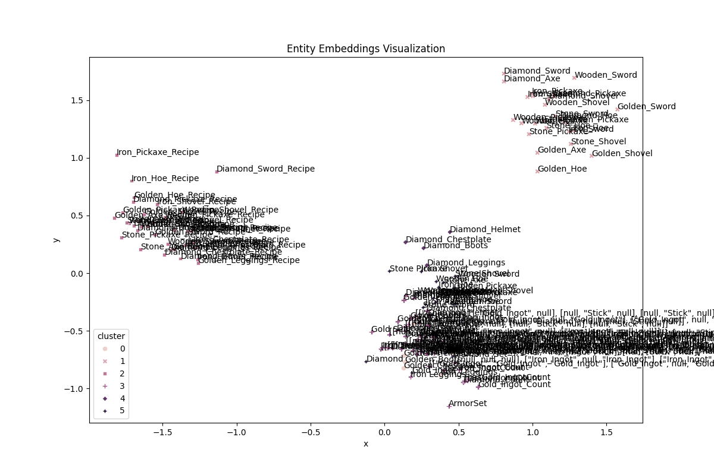
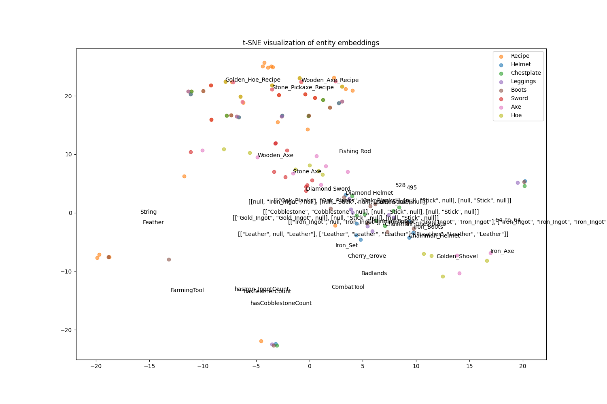

# Анализ качества модели эмбеддингов

## Общая информация

- Размерность эмбеддингов: 200
- Количество эпох: 400
- Размер батча: 64
- Скорость обучения (learning rate): 0.0005
- Устройство: CUDA

## Динамика обучения

Анализ функции потерь показывает эффективное обучение модели:

- Начальная потеря (эпоха 10): 5.6244
- Финальная потеря (эпоха 400): 0.0726

Наблюдается стабильное снижение функции потерь с заметными этапами:

1. Быстрое снижение (эпохи 1-50): от 5.62 до 0.54
2. Средняя скорость снижения (эпохи 50-150): от 0.54 до 0.19
3. Медленное снижение (эпохи 150-400): от 0.19 до 0.07

## Метрики валидации

Модель показывает исключительно высокие результаты на валидационном наборе:

- Mean Rank: 1.13 (близко к идеальному значению 1.0)
- Mean Reciprocal Rank (MRR): 0.97 (очень высокое значение)
- Hits@1: 0.95 (95% правильных предсказаний на первой позиции)
- Hits@3: 0.99 (99% правильных предсказаний в топ-3)
- Hits@10: 1.00 (100% правильных предсказаний в топ-10)

## Статистика эмбеддингов

Распределение значений эмбеддингов показывает хорошую нормализацию:

- Среднее значение: -0.001 (близко к 0)
- Стандартное отклонение: 0.178
- Минимум: -0.609
- Максимум: 0.609

Симметричный диапазон значений и близкое к нулю среднее указывают на хорошо сбалансированные эмбеддинги.

## Кластерный анализ

Модель успешно сформировала семантически связные кластеры:

1. Кластер брони (Cluster 0): содержит различные типы брони
2. Кластер числовых значений и предметов (Cluster 1): содержит смешанные данные
3. Кластер инструментов (Cluster 2): содержит различные виды оружия и инструментов
4. Кластер рецептов (Cluster 3): группирует рецепты крафта
5. Кластер деревянных инструментов (Cluster 4): специализируется на деревянных предметах
6. Кластер материалов (Cluster 5): содержит базовые материалы

## t-SNE анализ

## Заключение

Модель демонстрирует отличные результаты по всем ключевым метрикам. Особенно впечатляют показатели MRR и Hits@k, указывающие на высокую точность в задачах ранжирования и предсказания связей. Кластерный анализ подтверждает, что модель успешно улавливает семантические связи между сущностями Minecraft.

Единственным потенциальным направлением для улучшения может быть дальнейшая оптимизация функции потерь, хотя текущее значение 0.0726 уже является достаточно низким.
