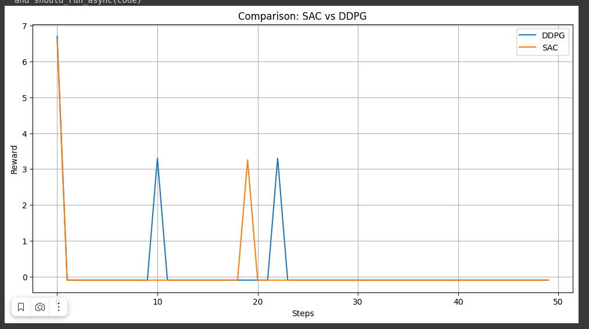
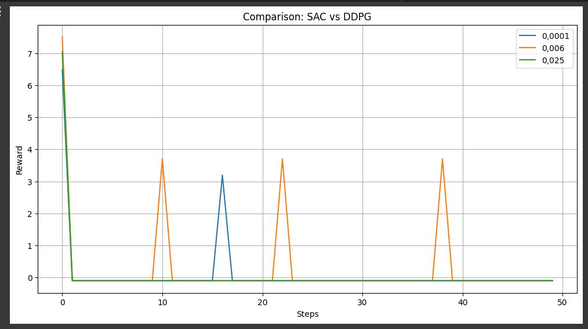

## Валидация и тестирование систем ИИ

Выполнил: Большим М.А. P4240, Мангараков А.Д. 4241

# Лабораторная работа №2

Для выполнения данной лабораторной работы необходимо было использовать окружение с применением Box в среде Car Racing в качестве
пространства действий, представленного на трех уровнях сложности.

## Пространство наблюдений (Observation space)

Пространство наблюдений представляет собой изображение гоночной трассы в виде массива RGB пикселей.

## Пространство действий (Action space)

Пространство действий представляет собой набор входов для управления автомобилем, таких как газ, тормоз, поворот и др.

## Ход работы

Графики наград для различных стратегий и сравнение различных значений Learning rate:

---

## Вывод

LR очень долго подбирались - модель не сходилась и не было представительных для анализа
результатов. В ходе эмпирического подбора выяснилось, что
значения LR в диапазоне [0.0025, 0.004] оказались оптимальными.

Эксперименты с различными стратегиями и learning rate позволяют лучше понять,
какие параметры лучше всего подходят для конкретных задач. Различия в наградах
между epsilon-greedy стратегией и softmax минимальны, с единственным отличием в
большей дисперсии у softmax, что свидетельствует о большем внимании к исследованию
в данной стратегии.
