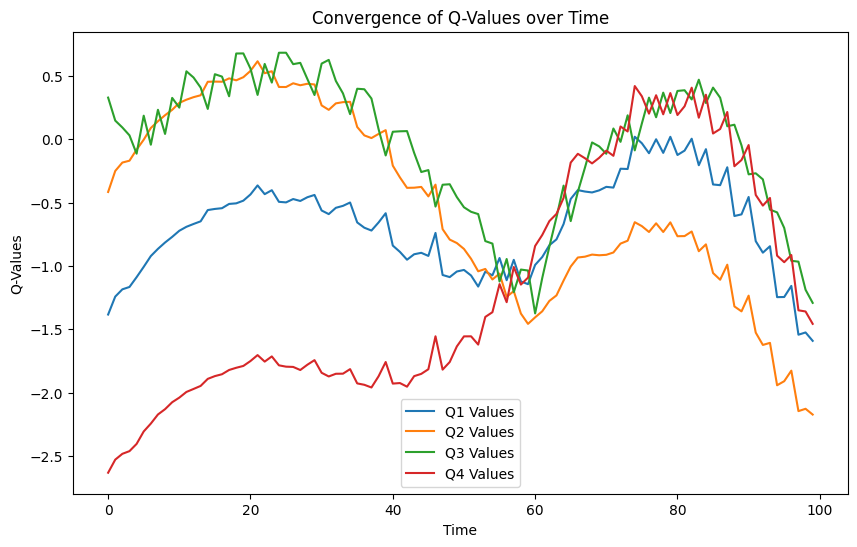
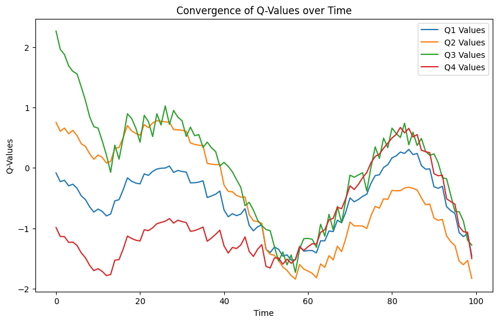
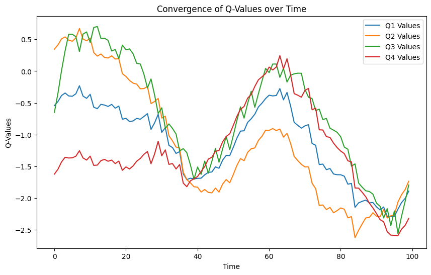

## Валидация и тестирование систем ИИ

Выполнил: Большим М.А. P4240, Мангараков А.Д. 4241

# Лабораторная работа №3

В рамках лабораторной работы был исследован параметр Discount factor, проведены эксперименты, подбирая наиболее
оптимальный параметр для рассмотренной задачи, настраивая дисконтный фактор и анализируя изученные метрики.

До обучения модели с discount_factor = 0.01, mean_reward:-332.74 +/- 143.90
После обучения модели с discount_factor = 0.01, mean_reward:-122.08 +/- 180.93

До обучения модели с discount_factor = 0.45, mean_reward:-133.32 +/- 35.97
После обучения модели с discount_factor = 0.45, mean_reward:-133.65 +/- 128.80

До обучения модели с discount_factor = 0.1, mean_reward:-1095.26 +/- 1276.60
После обучения модели с discount_factor = 0.1, mean_reward:-199.59 +/- 161.98

Оптимальным является значение 0.1, так как средний reward при данном значении максимален.
 
