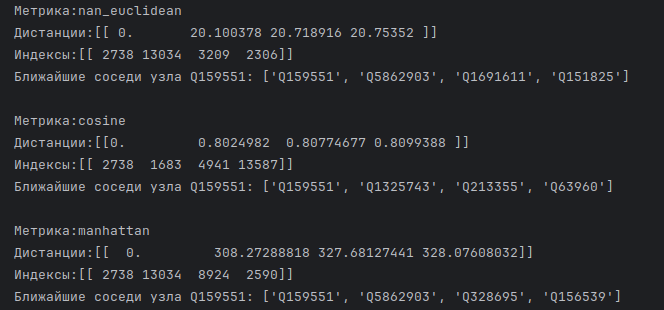
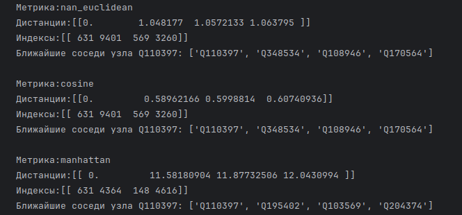

## Валидация и тестирование систем ИИ

Выполнил: Большим М.А. P4240, Мангараков А.Д. 4241

### Лабораторная работа 5

### Задание

Для выполнения поставленного задания был выбран датасет CoDExMedium.

Для сравнения были выбраны модели ComplEx и HolE

### Выполнение

[Код работы](Lab5.ipynb)

[Датасет](https://pykeen.readthedocs.io/en/stable/api/pykeen.datasets.CoDExMedium.html#pykeen.datasets.CoDExMedium)

#### Результат ComplEx

#### Результат HolE

#### Заключение
Модель ComplEx показывает себя лучше Hole на увеличении количества эпох. 
На более низких эпохах результат работы не сильно отличается друг от друга.

В обоих случаях самой полезной метрикой расстояния между сущностями оказалось косинусное расстояние, так как пространство ни нормализовано, ни дискретно для использования евклидова и манхеттенского расстояния соответственно.