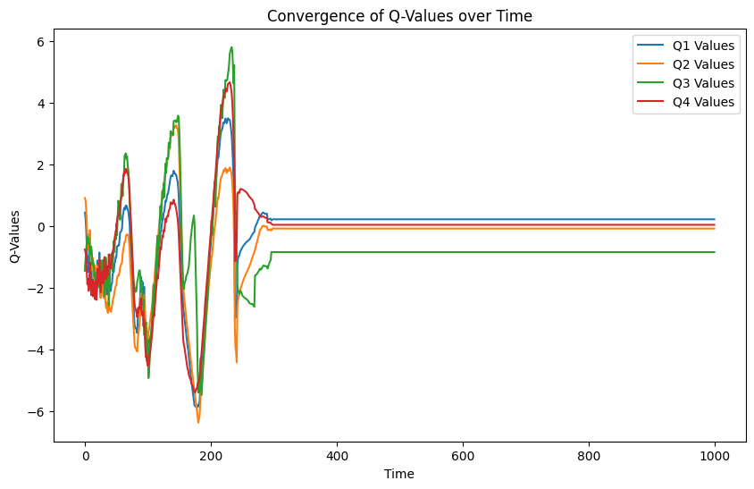
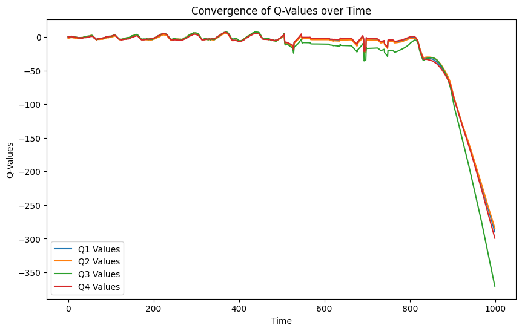
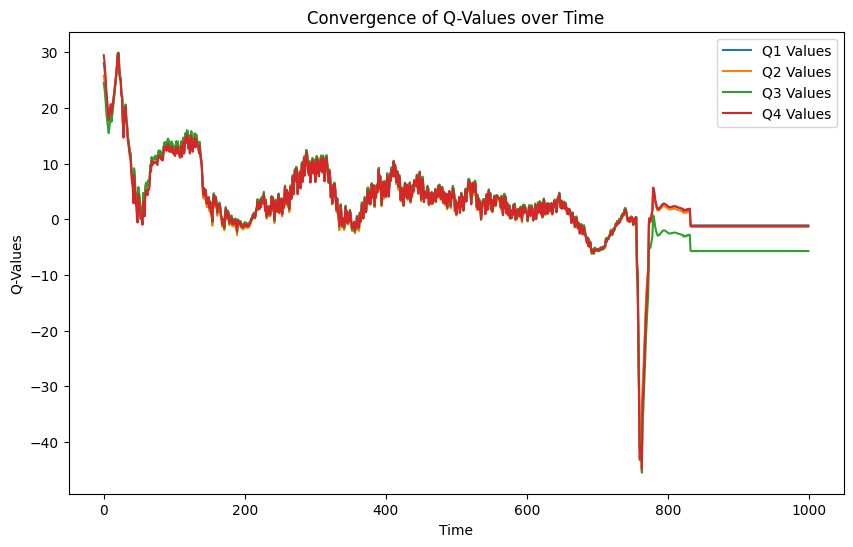

## Discount_factor, метрики “Средняя награда за эпизод”, “Сходимость Q-значений”, “Длина эпизода” и так далее

## Ефаринов Павел Андреевич

Для выполнения работы была выбрана среда [LunarLander](https://gymnasium.farama.org/environments/box2d/lunar_lander/)

#### Описание среды

##### Action space

0. Ничего не делать
1. Поворот по часовой
2. Запуск основного двигателя
3. Поворот против часовой

##### Observation space

8-ми мерный вектор

Координаты X и Y, линейные скорости по осям, угол, угловая скорость, касается ли каждая из опор земли.

##### Параметры

* Continuous - при True action_space будет Box
* Gravity - Сила притяжения
* Enable wind - наличие ветра (выключен, для упрощения обучения)
* Turbulance power - Случайные изменения угла

#### Обучение

Для подбора discount_factor были выбраны значения `[0.01, 0.5, 0.99]`. Для обучения были выбраны параметры `timestamp=3500000`. Для ускорения обучения среда была переключена на Т4-GPU

#### Результаты

##### discount_factor = 0.01

После обучения среднее время прохождения эпизода составило 378 степ. Средняя награда -11.27 +/- 186.09

Учитывая, что награда за посадку - 100, можно предположить, что агент не успевает выполнить более “дальнюю” задачу посадки, а вместо этого сосредоточен на получении награды за выравнивание.

##### discount_factor = 0.5

После обучения среднее время прохождения эпизода составило 506 степов. Средняя награда 12.98 +/- 177.86

По графику видно, что агент не выполняет успешно посадку, но и падения не происходит (в противном случае, состояние окружения бы не менялось, как и Q-values)

##### discount_factor = 0.99

После обучения среднее время прохождения эпизода составило 961 степов. Средняя награда 154.03 +/- 110.36

По графику видно, что значения Q-Values очень близки друг к другу, причем увеличено время прохождения эпизода, скорее всего, т.к. за малую скорость перемещения выдается награда.

В целом, по средней награде видно, что для discount_factor = 0.99 обучение прошло успешнее всего (больше среднее значение и меньше std, чем при остальных значениях)

