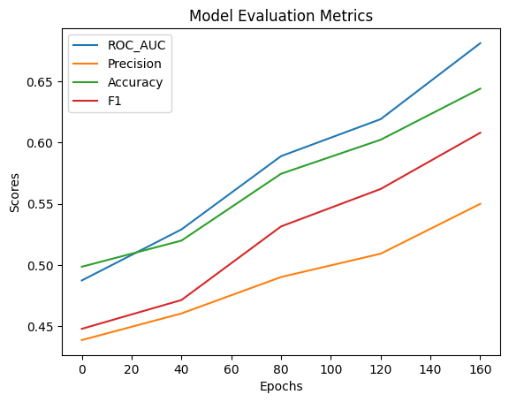
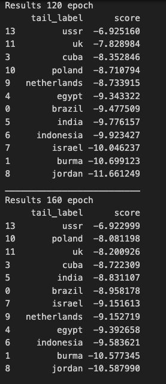

# Лабораторная работа 6

Выполнили:
* Герасимчук Михаил (P4241)
* Проскурин Глеб (P4241)

# Метрики для оценки работы модели

* ROC-AUC - это метрика, используемая для оценки производительности бинарной классификационной модели. Измеряет площадь под кривой ROC, которая отображает соотношение верно положительных случаев к ложно положительным случаям при различных значениях порога. Более высокий показатель ROC-AUC указывает на лучшую дискриминацию между положительными и отрицательными случаями.

* Precision - это метрика, оценивающая точность положительных предсказаний классификационной модели. Рассчитывается как отношение верно положительных предсказаний к общему числу положительных предсказаний (верно положительные + ложно положительные). Precision особенно важна, когда стоимость ложно положительных случаев высока.

* Accuracy - простая метрика, измеряющая общую правильность классификационной модели. Рассчитывается как отношение правильно предсказанных случаев (верно положительные + верно отрицательные) к общему числу случаев. В то время как Accuracy легко интерпретировать, она может быть несостоятельной для несбалансированных наборов данных, где один класс значительно превосходит другой.

* F1-мера - это гармоническое среднее точности и полноты.
Обеспечивает баланс между точностью и полнотой, что делает ее подходящей метрикой для несбалансированных наборов данных.

# Выводы:
1. Произвели обучения двух моделей TransE и ComplEx.
2. Получили графики зависимости точности от количества эпох;
    * Для модели ComplEx:
    
    * Для модели TransE:
    
3. Выполнили предсказания для удалённых связей с помощью каждой модели TransE и ComplEx:
    * Для модели ComplEx:
    
    * Для модели TransE:
    
4. Исходя из графиков обучения мы можем увидеть, что метрики у модели ComplEx выше.