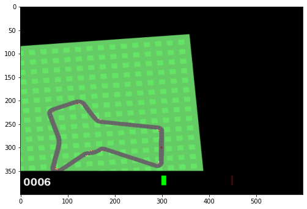
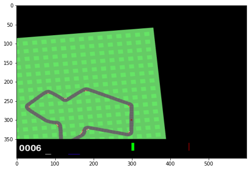
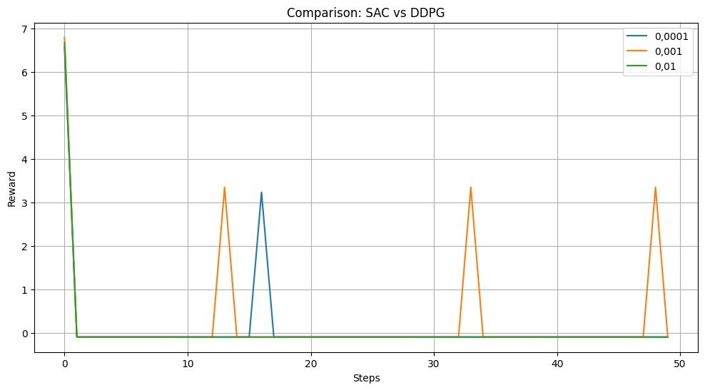

## Лабораторные работы по "Валидация и тестирование систем ИИ"

Выполнил: Грищенков Никита, P4240

### Лабораторная работа 2
#### Задание

1. Изучить ноутбук для данной работы
2. Выбрать две стратегии для своей среды
3. Провести эксперименты

#### Вывод

В ходе работы, были изучены стратегии разведки и эксплуатации, проведен сравнительный анализ: SAC и DDPG. 

##### Этапы рыботы:

1. **Установка библиотек.**
 - Установка библиотек: Gym, Stable-Baselines3, PyVirtualDisplay, Xvfb.
2. **Настройка окружения.**
 - Импорт библиотек: Gym, Stable-Baselines3.
 - Создано окружение для Ant и Car Racing.
 - Извлечено пространство наблюдения,действий для обучения.
3. **Исследование стратегий.**
 - Epsilon-Greedy, Softmax, Upper Confidence Bound
4. **Тестирование моделей.**
5. **Построение графика.**
6. **Исследование Learning Rate.**

