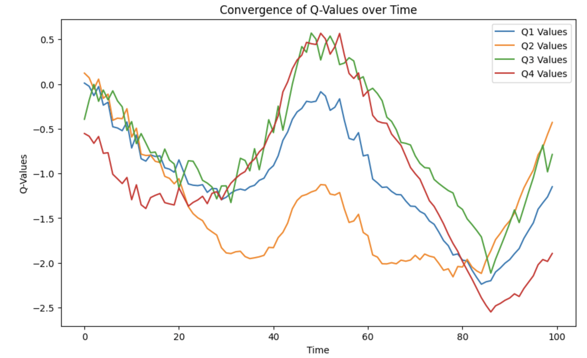
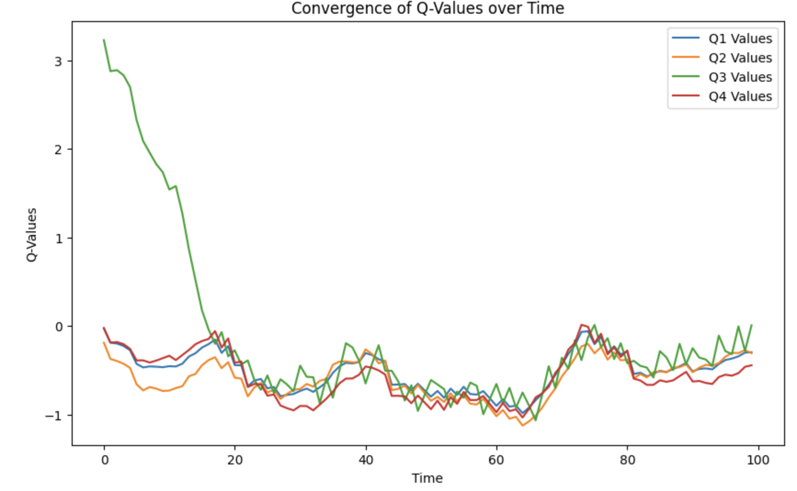
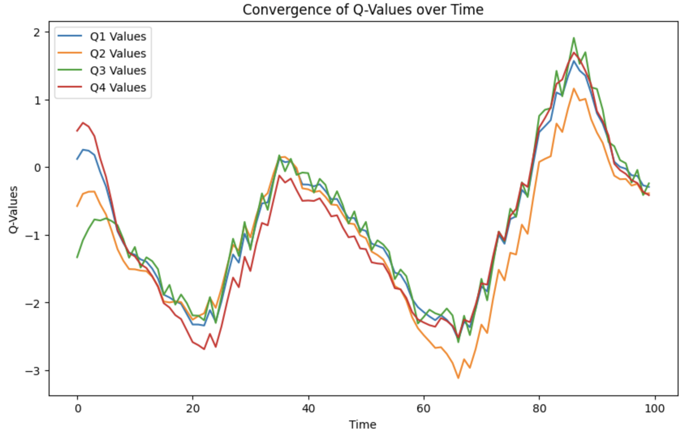

## Лабораторные работы по "Валидация и тестирование систем ИИ"

Выполнил: Грищенков Никита, P4240

### Лабораторная работа 3
В данной работе необходимо провести эксперименты, подбирая наиболее оптимальный discount_factor для выбранной среды. В данной работе используется среда LunarLander
### Результаты

#### discount_factor = 0.01

После обучения mean_reward:-123.18 +/- 137.45

#### discount_factor = 0.5

После обучения mean_reward:-68.64 +/- 125.21

#### discount_factor = 0.99

После обучения mean_reward:-115.52 +/- 35.96

### Выводы
После экспериментов с discount_factor мы пришли к выводу что оптимальным является значении 0.5, так как средний reward при данном значении максимален.