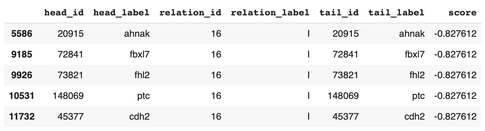

## Лабораторные работы по "Валидация и тестирование систем ИИ"

Выполнил: Грищенков Никита, P4240

### Лабораторная работа 4

#### Описание проделанной работы
В рамках лабораторной работы была проведена работа по обучению графовой нейронной сети с использованием датасета "pharmKG" из библиотеки Pykeen. Целью работы ставилось определение зависимостей и выявление отношений между различными странами.

Для реализации поставленной задачи была выбрана модель графовой нейронной сети (GNN), как один из актуальных и эффективных подходов эмбеддинга сущностей.

На вход сети поступали данные датасета, состоящего из многочисленных троек.

В процессе обучения нейронной сети были получены представления (эмбеддинги) для каждой из сущностей. Эмбеддинги позволили обнаружить скрытые взаимосвязи, которые не были явно указаны в исходных данных.

По окончании обучения сети, были выведены тройки, получившие наивысший score, который оценивает вероятность верности тройки.

#### Заключение
В результате проведенного обучения модель демонстрирует хорошие результаты и может быть использована для дальнейших исследований и прогнозов.