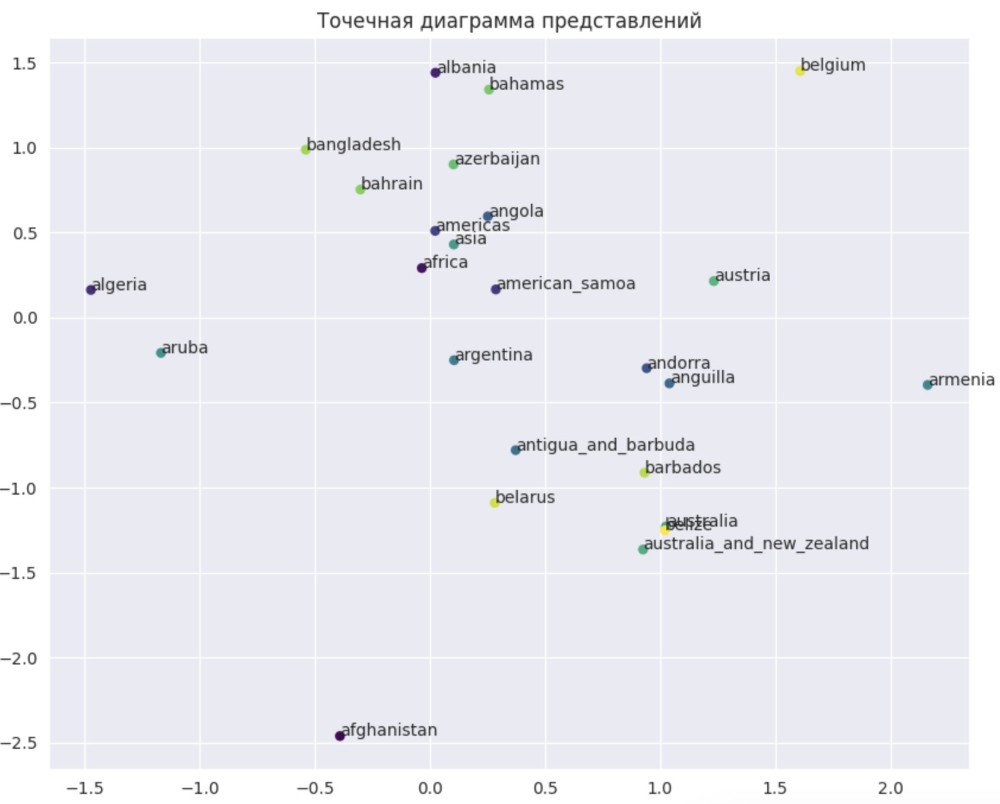

## Лабораторные работы по "Валидация и тестирование систем ИИ"

Выполнил: Грищенков Никита, P4240

### Лабораторная работа 5
В рамках лабораторной работы было совершено знакомство с понятием схожести между узлами графа (Node Similarity). Три распространенные метрики для этой задачи - это Косинусная схожесть, Манхэттенское расстояние и Евклидово расстояние.

Выполнена следующая последовательность действий:
<li> Установка зависимостей и импорт необходимых пакетов (pykeen)
<li> Импорт выбранного датасета
<li> Обучение модели, используя модель ComplEx
<li> Расчет метрик оценки работы модели
<li> Получение представлений узлов
<li> Измерение Node Similarity
<li> Поиск соседей узла
<li> Исследование влияния числа эпох обучения, сравнение различных моделей, анализ случайных узлов

#### Датасет Countries

|**Модель**|**Hits1**|**Hits3**|**Hits5**|**Hits10**|**MRR**|**Ближайшие для afghanistan (cosine)**|**Ближайшие для serbia (cosine)**|
|---|---|---|---|---|---|---|---|
|ComplEx, 100 epochs|0.000|0.000|0.000|0.020|0.015|'sri_lanka', 'suriname', 'kiribati'|'americas', 'bulgaria', 'guernsey'|
|HolE, 10 epochs|0.062|0.250|0.416|0.625|0.219|'bhutan', 'pakistan', 'kyrgyzstan'|'albania', 'greece', 'croatia'|
|TransE, 100 epochs|0.020|0.100|0.208|0.333|0.114|'mali', 'iran', 'china'|'kosovo', 'bulgaria', 'hungary'|

Снижение числа эпох ниже определенного предела существенно снижает точность сети. Уменьшение числа эпох до 10 значительно понизило точность. В каждом случае необходимо анализировать график функции потерь для выбора оптимального числа эпох. В рамках данной работы лучше всего показала себя модель HolE, которая превзошла по точности модель ComplEx.