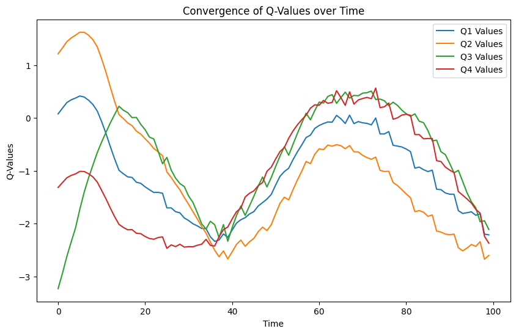
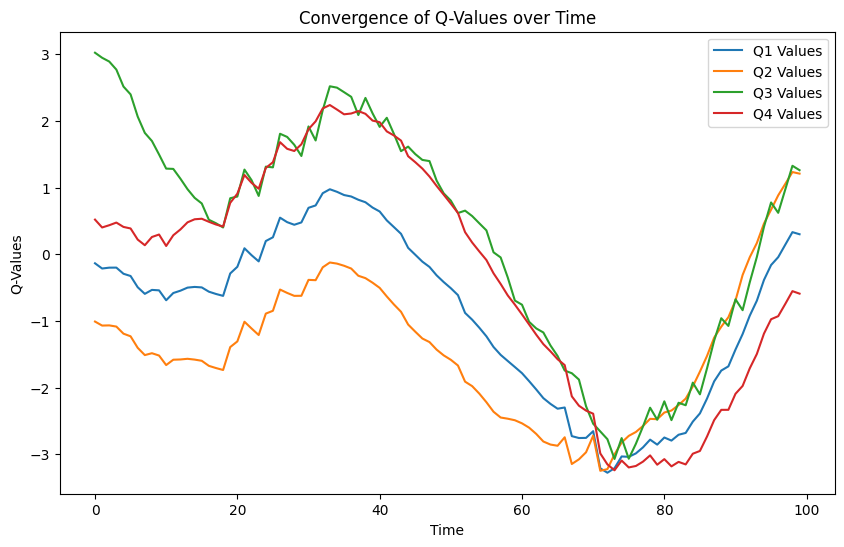

# Лабораторная работа №3

## Описание 
В данной работе необходимо провести эксперименты,
подбирая наиболее оптимальный discount_factor для выбранной среды (Lunar Lander)

### Описание среды
Lunar Lander
Данные, подающиеся на вход (observation space) представляют вектор из 8 значений:
* 1: координата X посадочного модуля
* 2: координата Y посадочного модуля
* 3: скорость вдоль оси X
* 4: скорость вдоль оси Y
* 5: угол
* 6: угловая скорость
* 7: касается ли левая нога земли
* 8: касается ли правая нога земли

Значения, ожидаемые на выходе (action space):

* 0: ничего не делать
* 1: сработал левый двигатель ориентации
* 2: запуск главного двигателя
* 3: включить двигатель правильной ориентации

Посадочный модуль стартует с самого верха экрана (максимум по оси Y) из середины (середина оси X) со случайными начальными скоростями вдоль обеих осей.
## Результаты

### discount_factor = 0.01

После обучения mean_reward:-211.39 +/- 118.26

### discount_factor = 0.5

После обучения mean_reward:-40.29 +/- 144.33

### discount_factor = 0.99

После обучения -231.78 +/- 108.24

## Выводы
После экспериментов с discount_factor можно сделать вывод что оптимальным является значении 0.5, так как средний reward при данном значении максимален.