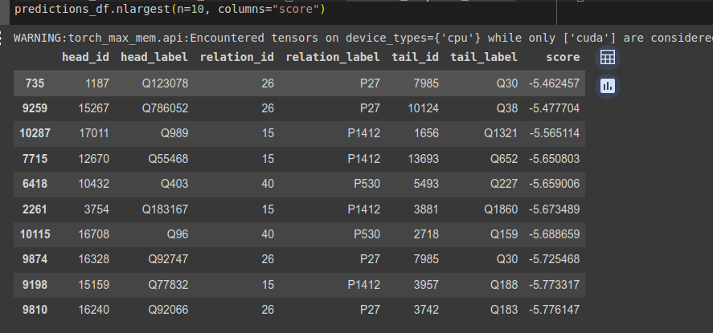

# Лабораторная работа №4
Выполнил: Грошев Виталий

[Датасет](https://pykeen.readthedocs.io/en/stable/api/pykeen.datasets.CoDExMedium.html#pykeen.datasets.CoDExMedium)

В ходе выполнения лабораторной работы осуществлялось обучение графовой нейронной сети на датасете "CoDExMedium",
который включает в себя информацию из Википедии и Викиданных.

## Результаты

Обучение составляло 20 эпох и запускалось на локальном компьютере.
Работу на GPU настроить не удалось, поэтому обучение выполнялось на CPU, что заняло примерно 5 минут.

Ниже приведены триплеты (ребро и две его вершины в терминах графа),
получившие наибольший score по результатам обучения. 

