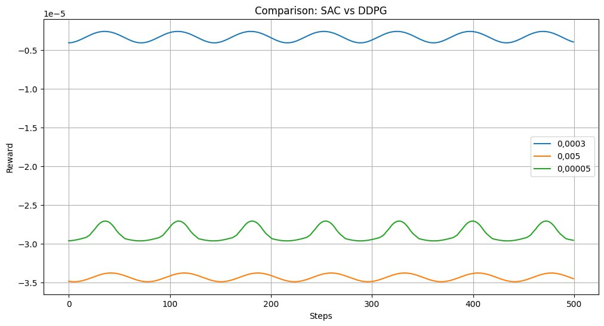
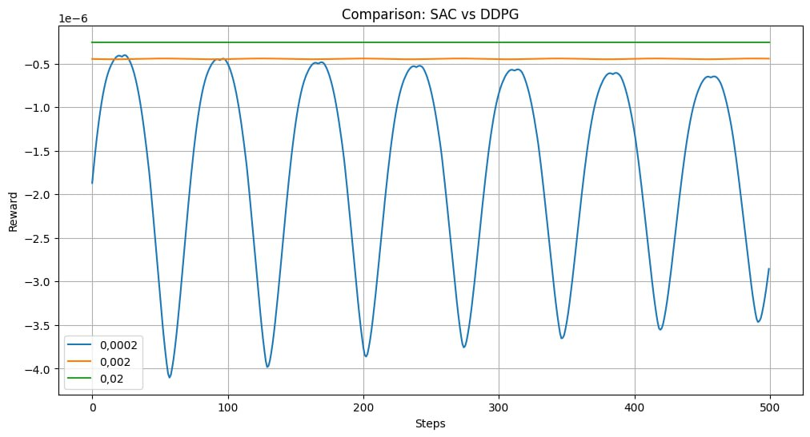

## Валидация и тестирование систем ИИ

Выполнил: Беликов П.Г. P4241

### Лабораторная работа 2

### Задание 

Установка библиотек для работы над лабораторной работой (Gym, Stable-Baselines3, PyVirtualDisplay, Xvfb)
Создание окружения (MountainCarContinuous-v0).
Исследование различных стратегий.
Тестирование различных моделей (DDPG, SAC).
Построение графика, который отображает процесс обучения этих моделей.
Исследование влияния Learning Rate .

#### Эксперимент 1

#### Эксперимент 2

#### Заключение
В ходе данной лабораторной работы мы не только изучали стратегии исследования и эксплуатации, но и проводили сравнение двух алгоритмов обучения с подкреплением: мягких критических факторов (SAC) и глубоких детерминированных градиентов политики (DDPG).

Алгоритм SAC представляет собой метод обучения с подкреплением, активно применяющий стратегии исследования и эксплуатации. Основываясь на принципе максимизации энтропии, он помогает преодолеть проблему избыточного доверия к действиям агента. В рамках наших лабораторных экспериментов мы оценивали, как SAC управляется с балансом между исследованием и эксплуатацией, и какие результаты он показывает в решении выбранной задачи.

DDPG, в свою очередь, является алгоритмом, специально разработанным для задач с непрерывными пространствами действий. Он также активно применяет стратегии исследования и эксплуатации, и его производительность может значительно зависеть от выбора гиперпараметров, таких как скорость обучения. В лаборатории мы сопоставляли производительность DDPG и SAC, а также исследовали, как изменение скорости обучения влияет на обучение с использованием обоих алгоритмов.

Сравнительный анализ позволил студентам лучше понять поведение различных алгоритмов в условиях исследования и эксплуатации. Это также дало нам возможность оценить, как различные стратегии и параметры влияют на процесс обучения и результаты каждого из алгоритмов.