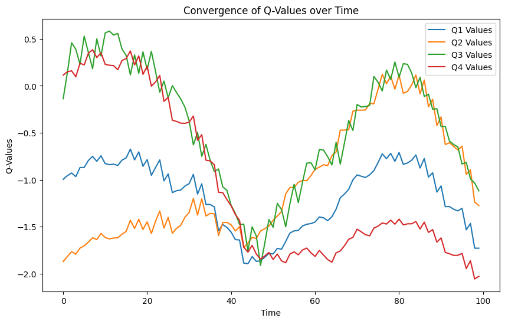
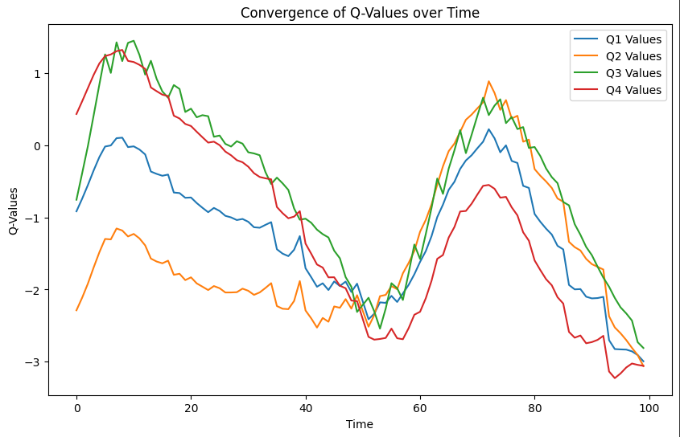
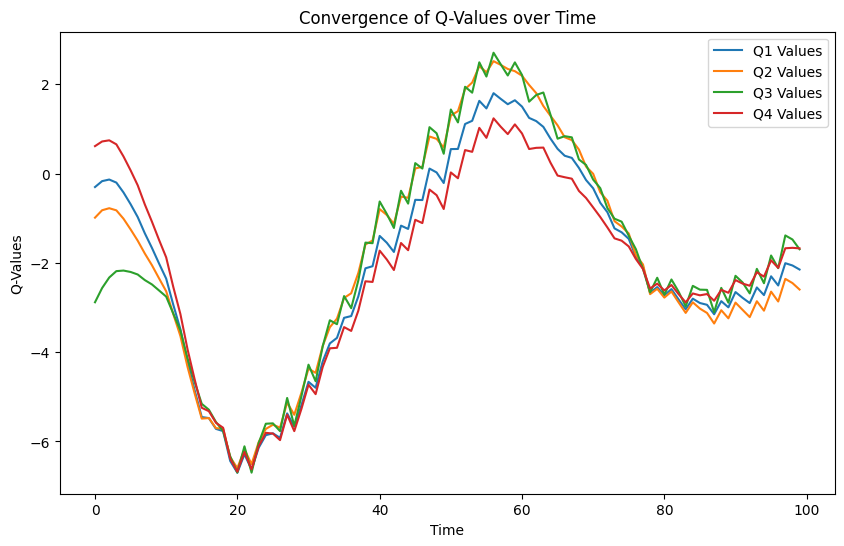

## Валидация и тестирование систем ИИ

Выполнил: Беликов П.Г. P4241

### Лабораторная работа 3

### Задание 

Установка библиотек для работы над лабораторной работой (Gym, Stable-Baselines3, PyVirtualDisplay, Xvfb)
Создание окружения (MountainCarContinuous-v0).
Настройка discount factor для получения наибольшей средней награды

### Выполнение

#### Эксперимент 1

#### Эксперимент 2

#### Эксперимент 3

#### Заключение
Из всех выбранных значений discount factor наиболее оптимальным является 0.5, при нем среднее значение награды достигает максимального -42.29 +/- 140.33