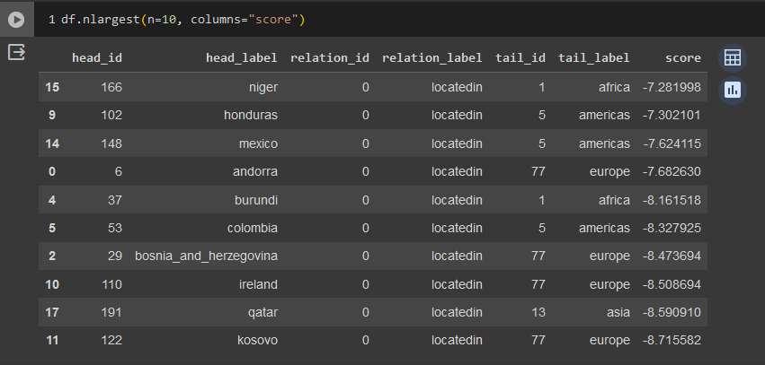

## Валидация и тестирование систем ИИ

Выполнил: Беликов П.Г. P4241

### Лабораторная работа 4

### Задание 

Для выполнения поставленного задания был выбран датасет Countries

### Выполнение

#### Результат

#### Заключение
В результате работы, среди 10 самых высоких оценок score, модель выдвинула все предположения об отношениях между странами корректно.