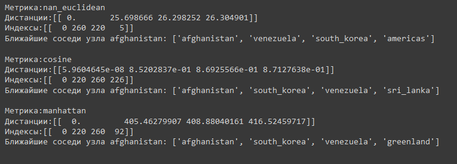
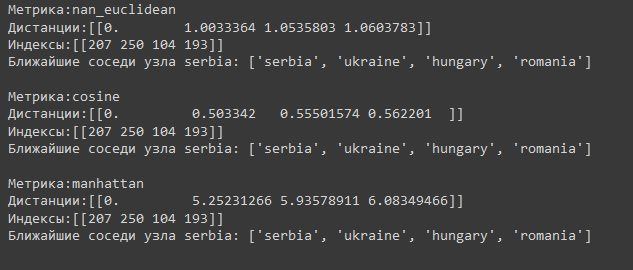

## Валидация и тестирование систем ИИ

Выполнил: Беликов П.Г. P4241

### Лабораторная работа 5

### Задание 

Для выполнения поставленного задания был выбран датасет Countries
Для сравнения были выбраны модели ComplEx и TransE
### Выполнение

#### Результат
#### ComplEx

#### TransE

#### Заключение
Модель TransE показывает себя лучше ComplEx, а изменение числа эпох не всегда влияет на улучшение метрик качества
