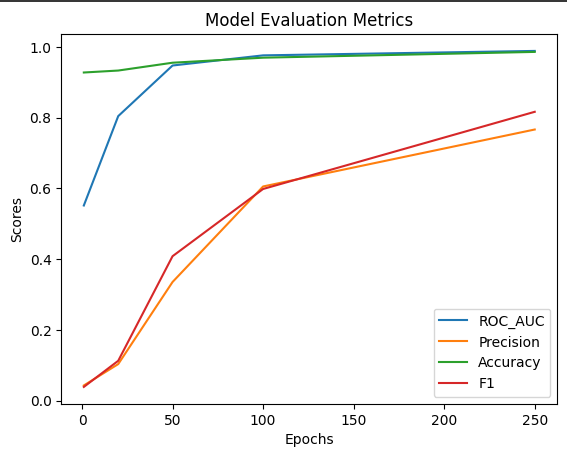

## Валидация и тестирование систем ИИ

Выполнил: Беликов П.Г. P4241

### Лабораторная работа 6

### Задание 

Для выполнения поставленного задания был выбран датасет Countries и модель TransE
### Выполнение

#### Результат
#### TransE

#### Заключение
Precision, Accuracy, и F1:

Метрики precision, accuracy и F1 предоставляют информацию о качестве классификации модели. Высокие значения этих метрик указывают на эффективность модели в правильном предсказании связей.

ROC-AUC:

ROC-AUC метрика измеряет способность модели различать между положительными и отрицательными классами при различных порогах. Значение ROC-AUC близкое к 1.0 говорит о высокой дискриминации, что подтверждает успешное обучение модели.

Все метрики растут прямо пропорцианально количеству эпох. Чем больше значения метрик, тем меньше ошибок модель совершает.
