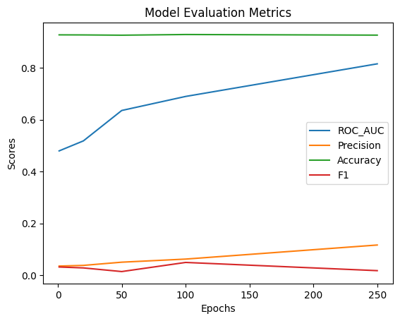
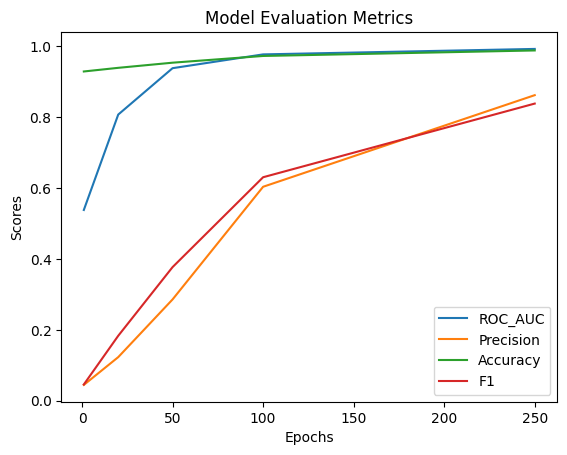

# Лабораторная работа №1

---
Выполнил Филиппенко Илья

### Данные
Для данной Лабораторной работы был выбран минималистичный датасет Countries в силу нехватки памяти (~~гугл отжал T4~~) - 217 сущностей, 2 вида отношений, 1158 триплетов.

### Ход работы

В ходе работы обучены модели TransE и ComplEx с контрольными точками после 1, 20, 50, 100 и 250 эпох. Рост метрик отображен на изображениях ниже:

Метрики модели ComplEx

Метрики модели TransE

Также произведена проверка результатов с помощью метода predict_target. 

---
### Выводы

Модель TransE оказалась эффективнее для выбранной задачи, тем не менее назвать ее предсказания после 250 эпох точными нельзя, однако дальнейшее обучение может грозить оверфиттингом.  

