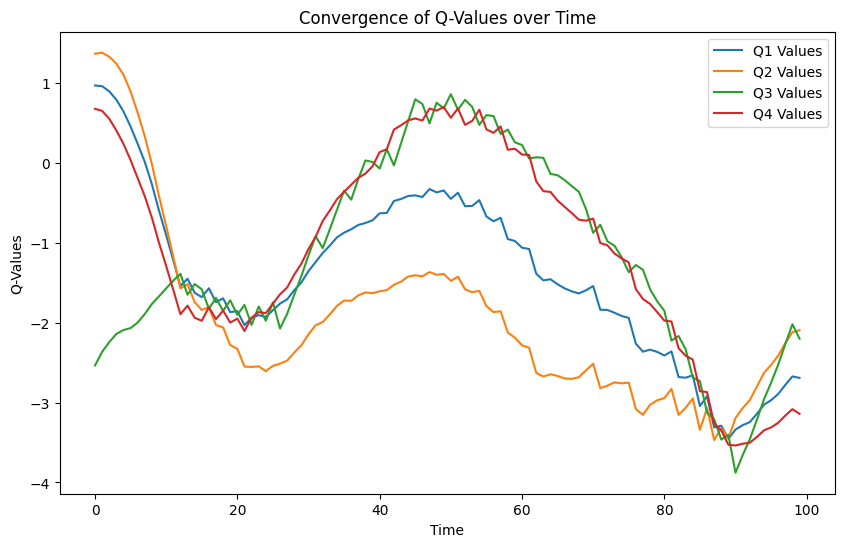
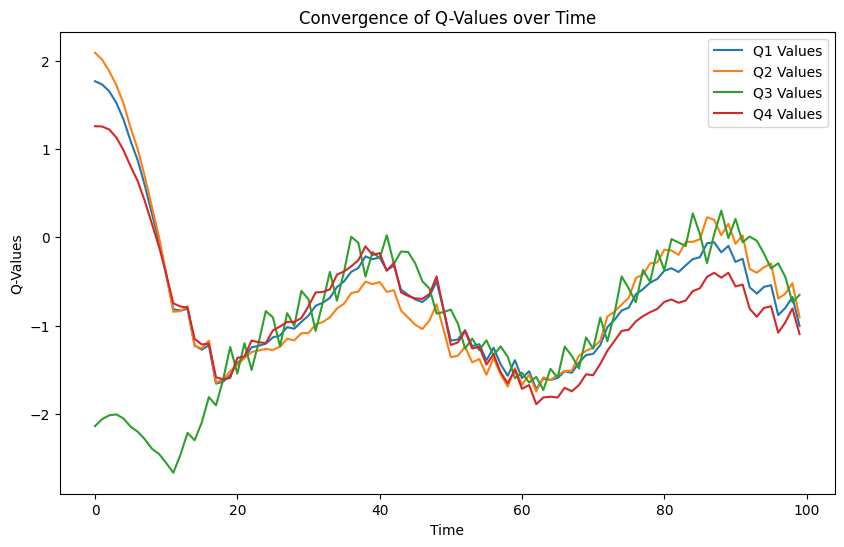
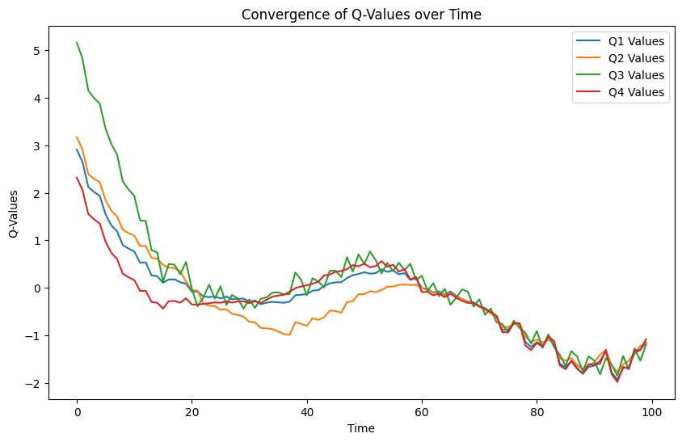

# Лабораторная работа 3

Выполнили:
* Герасимчук Михаил (P4241)
* Проскурин Глеб (P4241)

# Описание
В рамках данной лабораторной работы мы провели серию экспериментов по подбору наиболее оптимального `discount_factor`:
* Выьранная среда: LunarLander.

# Результаты
### discount_factor 0.01
Показатели:
* До обучения модели с discount_factor = 0.01, mean_reward:-133.16 +/- 45.12:
* После обучения модели с discount_factor = 0.01, mean_reward:-415.85 +/- 143.06
* Время обучения модели при discount_factor = 0.01 : 23.18100881576538 секунд.

### discount_factor 0.5
Показатели:
* До обучения модели с discount_factor = 0.5, mean_reward:-143.98 +/- 66.34
* После обучения модели с discount_factor = 0.5, mean_reward:-222.70 +/- 143.21
* Время обучения модели при discount_factor = 0.5 : 23.270755767822266 секунд.

### discount_factor 0.99
Показатели:
* До обучения модели с discount_factor = 0.99, mean_reward:-132.67 +/- 42.06
* После обучения модели с discount_factor = 0.99, mean_reward:-143.33 +/- 59.39
* Время обучения модели при discount_factor = 0.99 : 22.136041402816772 секунд.

### Mountain Car
`MDP Mountain Car` — это детерминированный MDP, который состоит из автомобиля, стохастически размещенного на дне синусоидальной впадины, причем единственными возможными действиями являются ускорения, которые можно приложить к автомобилю в любом направлении. Цель MDP — стратегически ускорить машину, чтобы достичь целевого состояния на вершине правого холма. В тренажерном зале есть две версии горной машины: одна с дискретными действиями, другая с непрерывными. Эта версия имеет дискретные действия.

### Динамика переходов
При действии горный автомобиль следует следующей динамике перехода:

скорость t+1 = скорость t + (действие - 1) * сила - cos(3 * положение t ) * гравитация

позиция t+1 = позиция t + скорость t+1

где сила = 0,001 и гравитация = 0,0025. Столкновения на обоих концах неупругие, при этом скорость равна 0 при столкновении со стеной. Позиция ограничивается диапазоном , а скорость ограничивается диапазоном .[-1.2, 0.6][-0.07, 0.07]

Показатели: 

| discount_factor | mean_reward | Изменения |
|-----------------|-------------|---|
| 0.01            | -200        | +-0 |
| 0.5             | -200        | +-0 |
| 0.99            | -200        | +-0 |

## Выводы
### Для LunarLander-v2
* Эксперименты показали, что наиболее оптимальный является значение 0.5, так как при нём  mean_reward максимален.
### для Mountain Car
* В резульате экспериментов с [0.01, 0.5, 0.99] значениями discount_factor-а, было выялявено, что стратегия по деланию алгоритма более или менее жадным не помогает при решении данной задачи
