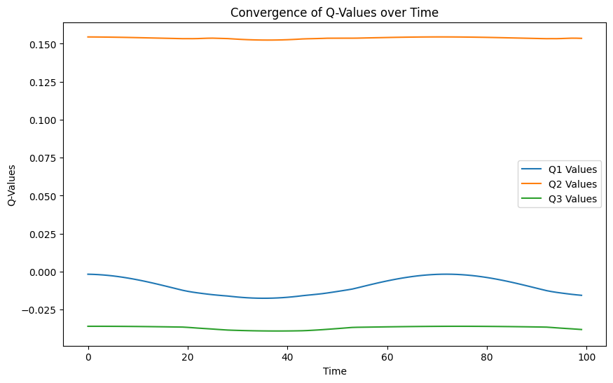

## Лабораторные работы по "Валидация и тестирование систем ИИ"
Выполнили:  
Расковалова Алена, P4241  
Строкова Анастасия, P4240

### Лабораторная работа 3
В рамках лабораторной работы был исследован параметр Discount factor, используемый в теории управления и обучения с подкреплением для оценки стоимости будущих вознаграждений.  
Выполнена следующая последовательность действий:
<li> Установка зависимостей и импорт необходимых пакетов
<li> Создание функции для извлечения значений из q-сети
<li> Создание функции для составления графика по значениям
<li> Создание окружения, модели, обучение модели, оценка модели до и после обучения, измерение времени обучения
<li> Создание функции для вычисления Q-values для некоторого набора предсказаний модели
<li> Проведение экспериментов с discount factor, discount_factors = [0.01,0.5,0.99]
<li> Подведение итогов
 

**Часть 1.LunarLander**  
[Код LunarLander](LR3_Lunar_Lander.ipynb)  

discount_factor = 0.01  
До обучения модели с discount_factor = 0.01, mean_reward:-577.21 +/- 178.96  
После обучения модели с discount_factor = 0.01, mean_reward:-179.04 +/- 132.94  
  

discount_factor = 0.5  
До обучения модели с discount_factor = 0.5, mean_reward:-890.24 +/- 445.62  
После обучения модели с discount_factor = 0.5, mean_reward:-211.00 +/- 162.95  
  

discount_factor = 0.99  
До обучения модели с discount_factor = 0.99, mean_reward:-355.78 +/- 182.20  
После обучения модели с discount_factor = 0.99, mean_reward:-126.10 +/- 111.77  
  
Оптимальным является значении 0.5, так как средний reward при данном значении максимален. 
 

**Часть 2. Среда MountainCar**  
[Код MountainCar](LR3_Mountain_Car.ipynb)  

discount_factor = 0.01  
До обучения модели с discount_factor = 0.01, mean_reward:-200.00 +/- 0.00  
После обучения модели с discount_factor = 0.01, mean_reward:-200.00 +/- 0.00  

discount_factor = 0.5  
До обучения модели с discount_factor = 0.5, mean_reward:-200.00 +/- 0.00  
После обучения модели с discount_factor = 0.5, mean_reward:-200.00 +/- 0.00  

discount_factor = 0.99  
До обучения модели с discount_factor = 0.5, mean_reward:-200.00 +/- 0.00  
После обучения модели с discount_factor = 0.5, mean_reward:-200.00 +/- 0.00  

На данную среду discount factor не оказывает влияния. 
 
