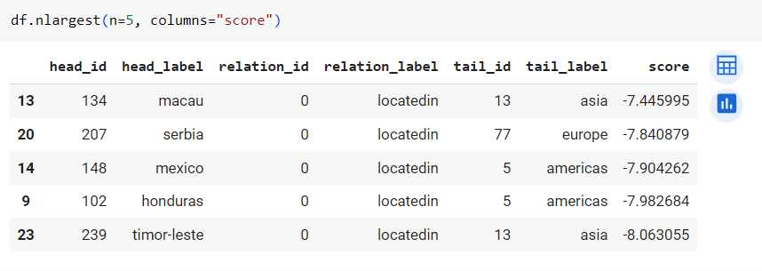

## Лабораторные работы по "Валидация и тестирование систем ИИ"
Выполнили:  
Расковалова Алена, P4241  
Строкова Анастасия, P4240

### Лабораторная работа 4
В рамках лабораторной работы было совершено знакомство с графовыми нейронными сетями. В GNN каждая вершина графа обновляется на основе её соседей, что позволяет модели учить представления вершин, учитывая их окружение.  
Выполнена следующая последовательность действий:
<li> Установка зависимостей и импорт необходимых пакетов (pykeen)
<li> Импорт выбранного датасета
<li> Получение тренировочных данных в виде троек сущность - отношение - сущность
<li> Обучение модели TransE, вывод результатов
<li> Вывод троек, получивших высший score
 

**Часть 1.Датасет Countries**  
[Код Countries](LR4_Countries.ipynbb)  
  
 

**Часть 2. Датасет PharmKG**  
[Код Pharm](LR4_PharmKG.ipynb)  
  

В результате выполнения данной лабораторной работы мы освоили применение графовых нейронных сетей (GNNs) для анализа зависимостей в графовых структурах данных. Эмбеддинги, извлеченные с использованием GNN, позволяют представить вершины графа в векторной форме, сохраняя важную структурную информацию.  

Тестирование модели на новых данных и валидация для подбора гиперпараметров с использованием датасета Kinships дали возможность оценить обобщающую способность и оптимальность модели. Библиотека Pykeen значительно упростила взаимодействие с графовыми данными.  

Выбор модели TransE и использование датасета Countries и PharmKG позволили успешно решить задачу предсказания отношений в контексте родственных связей. Заданные эпохи обучения и валидации позволили оценить производительность модели. Результаты включают в себя метрики производительности, потери на тренировочных данных, а также выдачу модели на тестовом и валидационном наборах данных. Рассчитанные оценки для validation троек и выделение троек с наивысшим score обеспечивают полноценный анализ эффективности разработанной модели на датасете Countries и PharmKG.  
