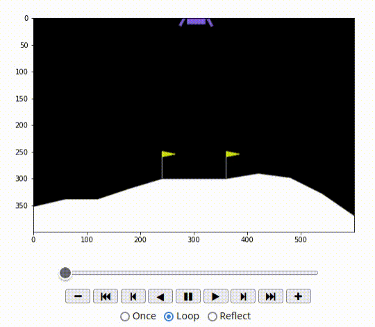

# Лабораторная работа 1

Выполнил:

Резбаев Радмир

### Reinforcement Learning (RL)

Reinforcement Learning (Обучение с подкреплением) — это класс машинного обучения, в котором агент обучается принимать решения путем взаимодействия с окружающей средой. Агент принимает действия, получает обратную связь в виде вознаграждения или штрафа, и стремится максимизировать кумулятивное вознаграждение.

### Q-learning
[Q-learning](https://en.wikipedia.org/wiki/Q-learning) — это один из методов обучения с подкреплением, используемый для обучения агента принимать оптимальные действия в конкретной среде. Агент стремится выучить функцию Q, которая оценивает ожидаемую награду для каждой пары состояние-действие.

### Тестирование и Валидация

В контексте RL, тестирование и валидация играют важную роль. После обучения модели агента необходимо оценить ее производительность (тестирование) и убедиться в ее способности обобщения к различным ситуациям (валидация).

Тестирование в RL включает в себя запуск обученной модели в реальной среде и измерение ее производительности на основе определенных метрик. Валидация, с другой стороны, может включать в себя проверку способности модели адаптироваться к новым условиям или изменениям в среде.

## Выбор среды

В данной работе была выбрана среда Lunar_Lander предоставляемая Gym

## Описание среды

Эта среда является классической проблемой оптимизации траектории ракеты. Посадочная площадка всегда находится в координатах (0,0). Координаты - это первые два числа в векторе состояния. Посадка за пределами посадочной площадки возможна. Топливо бесконечно, поэтому агент может научиться летать, а затем приземляться с первой попытки.

Доступны четыре дискретных действия:
    0: ничего не делать
    1: левый двигатель
    2: главный двигатель
    3: правый двигатель 

Состояние представляет собой 8-мерный вектор: 
   - координаты посадочного модуля в x и y
   - линейные скорости по x и y
   - угол, 
   - угловая скорость 
   - два значения, обозначающие находятся ли подставки на земле

После каждого шага присуждается вознаграждение. Общая награда за эпизод - это сумма наград за все шаги в эпизоде.

## Выводы:

1. Изучены новые библиотеки и зависимости (Gym, Stable-baselines3, PyVirtualDisplay и Xvfb). Они были использованы для создания среды и реализации алгоритма обучения с подкреплением

2. Изучен алгоритм DQN и использован для обучения модели глубокого обучения в среде Lunar Lander.

3. Модель обучалась в Google Collab на 400_000 временных шагов

4. Для виртуализации окружения использован виртуальный дисплей Xvfb, а также PyVirtualDisplay и Matplotlib, которые позволили отобразить результаты тестирования обученной модели в виде анимации.

5. Обученная модель была использована в задаче посадки на поверхность, но 400к шагов хватило только для того чтобы научить ее держать равновесие

   

   
