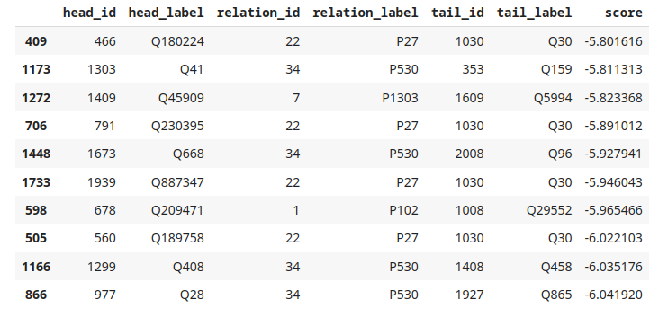

## Лабораторная работа 4
Выполнил:

Резбаев Р.

В рамках лабораторной работы было совершено знакомство с графовыми нейронными сетями. В GNN каждая вершина графа обновляется на основе её соседей, что позволяет модели учить представления вершин, учитывая их окружение.

В качестве датасета для этой лабораторной я выбрал "CoDExSmall"

CoDEx (Comprehensive Knowledge Graph Completion Benchmark) это набор  датасетов, извлеченных из Викиданных и Википедии. Эти датасеты были представлены и описаны в статье,  опубликованной на конференции EMNLP 2020

В результате выполнения данной лабораторной работы освоено применение графовых нейронных сетей (GNNs) для анализа зависимостей в графовых структурах данных. Эмбеддинги, извлеченные с использованием GNN, позволяют представить вершины графа в векторной форме, сохраняя важную структурную информацию.

Тестирование модели на новых данных и валидация для подбора гиперпараметров с дали возможность оценить обобщающую способность и оптимальность модели. Библиотека Pykeen значительно упростила взаимодействие с графовыми данными.

