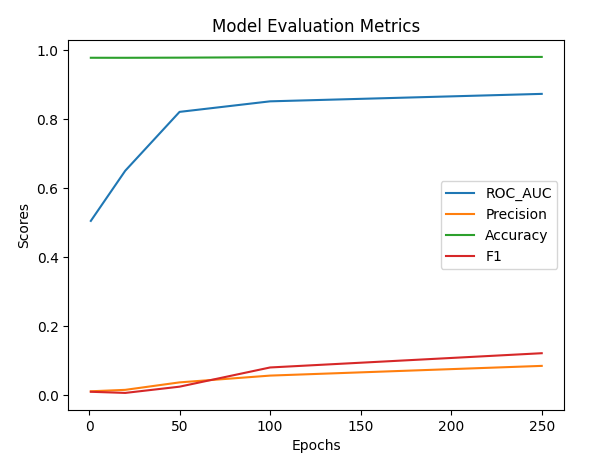

## Лабораторная работа 6

Выполнил:

Резбаев Р.

В качестве датасета для этой лабораторной я выбрал "CoDExSmall"

CoDEx (Comprehensive Knowledge Graph Completion Benchmark) это набор  датасетов, извлеченных из Викиданных и Википедии. Эти датасеты были представлены и описаны в статье,  опубликованной на конференции EMNLP 2020

Используя модели ComplEx и TransE на датасете CoDExSmall позволила успешно решить задачу предсказания отношений в графе. Полученные результаты могут быть использованы для улучшения графовых структур в различных областях, таких как социальные науки, биология, и информационные технологии.

