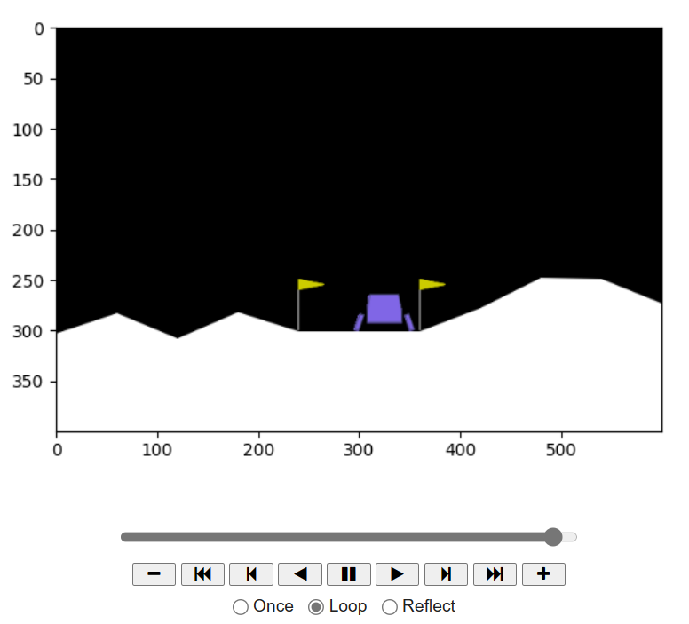

# Лабораторная  работа 1

Выполнил Шерман Марк, гр. P4240

## Задание
### Reinforcement Learning (RL)
Reinforcement Learning (Обучение с подкреплением) — это класс машинного обучения, в котором агент обучается принимать решения путем взаимодействия с окружающей средой. Агент принимает действия, получает обратную связь в виде вознаграждения или штрафа, и стремится максимизировать кумулятивное вознаграждение.

### Q-learning
Q-learning — это один из методов обучения с подкреплением, используемый для обучения агента принимать оптимальные действия в конкретной среде. Агент стремится выучить функцию Q, которая оценивает ожидаемую награду для каждой пары состояние-действие.

### Тестирование и Валидация
В контексте RL, тестирование и валидация играют важную роль. После обучения модели агента необходимо оценить ее производительность (тестирование) и убедиться в ее способности обобщения к различным ситуациям (валидация).

Тестирование в RL включает в себя запуск обученной модели в реальной среде и измерение ее производительности на основе определенных метрик. Валидация, с другой стороны, может включать в себя проверку способности модели адаптироваться к новым условиям или изменениям в среде.

## Выполнение

В качестве среды для обучения модели была выбрана [LunarLander-v2](https://gymnasium.farama.org/environments/box2d/lunar_lander/).

[Код решения](Lab1.ipynb)

## Вывод
В рамках проделанной работы удалось ознакомиться с библиотеками Gymnasium (предоставляющая окружение LunarLander-v2), Stable-Baselines3 (содержит модели для решения задач обучения с подкреплением)
и PyVirtualDisplay (для визуализации работы модели с окружением). Для модели DDPG удалось подобрать оптимальный набор параметров, позволивший обучить агента взаимодействовать со средой (в выбранном варианте агентом выступал лунный модуль, который обучался посадке на Луну)
Данная работа помогла приобрести навыки для решения задач обучения с подкреплением.

