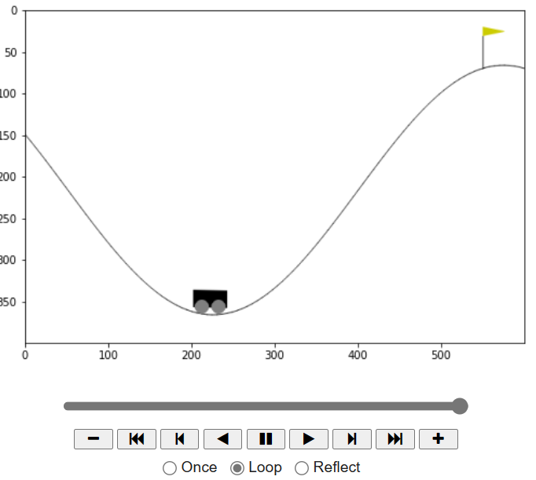
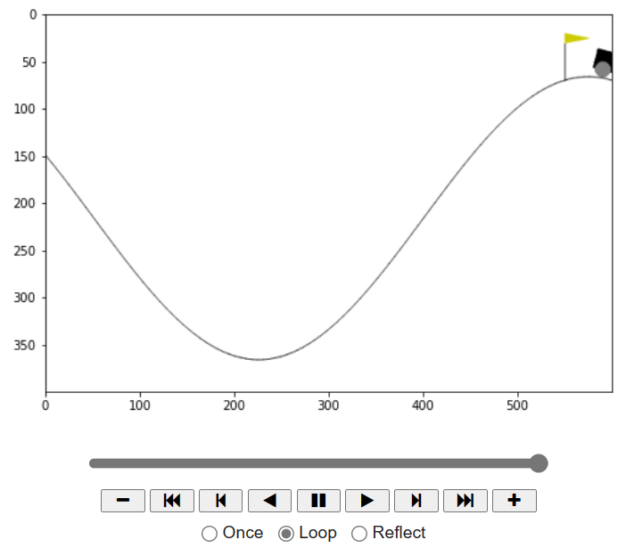
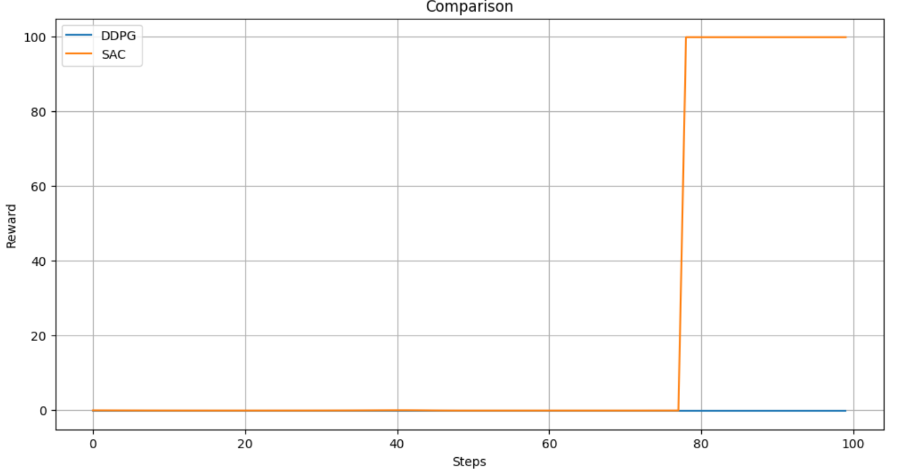
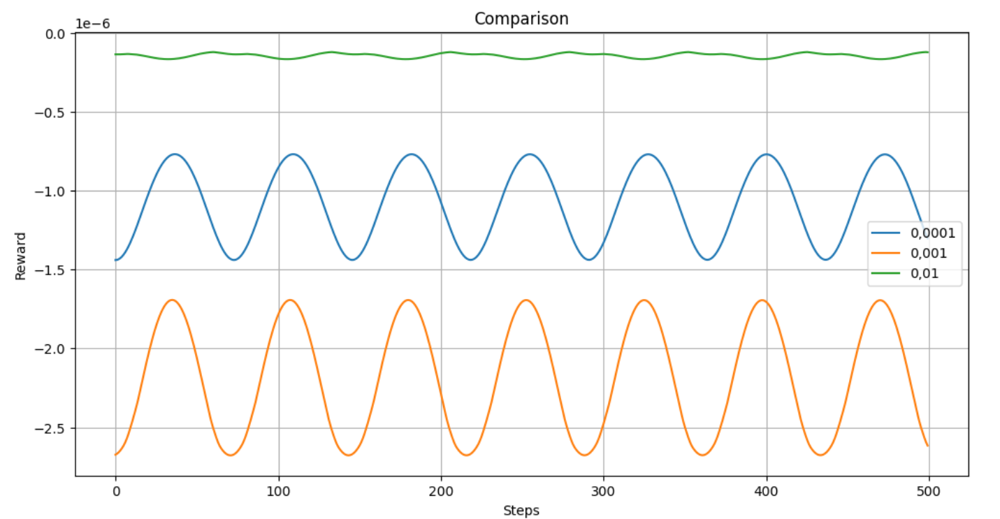
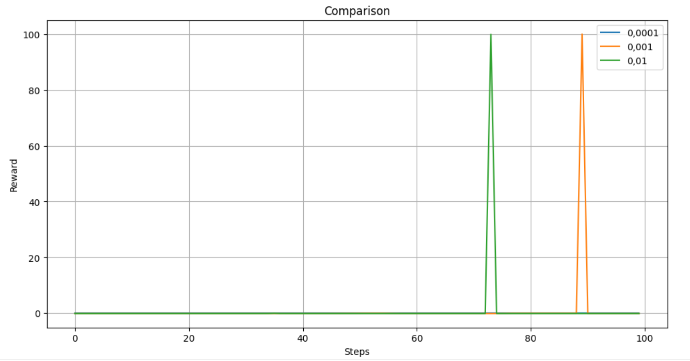

# Лабораторная работа 2

Выполнил Шерман Марк, гр. P4240

## Задание
1. Изучите ноутбук для данной работы
2. Выберите две стратегии для своей среды
3. Провести эксперименты, изменяя параметры стратегий, чтобы более глубоко понять их влияние на обучение модели.
4. Опишите выводы в readme и загрузите свои файлы на github.

## Выполнение

В качестве среды для обучения модели была выбрана [MountainCarContinuous-v0](https://gymnasium.farama.org/environments/classic_control/mountain_car_continuous/).

[Код решения](Lab2.ipynb)

## Вывод

В данной работе были рассмотрены две модели машинного обучения - DDPG и SAC. Певроначально для каждой из этих моделей был произведён поиск оптимального набора параметров.
Для первой модели к сожалению не удалось найти таковой набор, из-за чего агент не смог решить задачу. Однако есть предположение, что при увеличении времени обучения, удасться достичь приемлеого результата.

В свою очередь для SAC нашёлся такой набор параметров и агент успешщно справился с задачей.

При сравнении графика наград двух решений, видно что на примерно 78 шаге SAC смогла справиться с задачей.

Далее мы рассмотрели зависимость качества работы модели от learning rate для модели SAC. Рассматривали значения 0.01, 0.001 и 0.0001.
Каждую модель будем обучать 10000 шагов. Если брать модель с параметрами по умолчанию и менять только learning rate, то алгоритм не сможет обучиться.

Но если взять оптимальный набор параметров, то с learning rate 0.01 и 0.001 модель сможет обучиться. Наименьшему же learning rate не будет достаточно 10000 шагов для сходимости.

