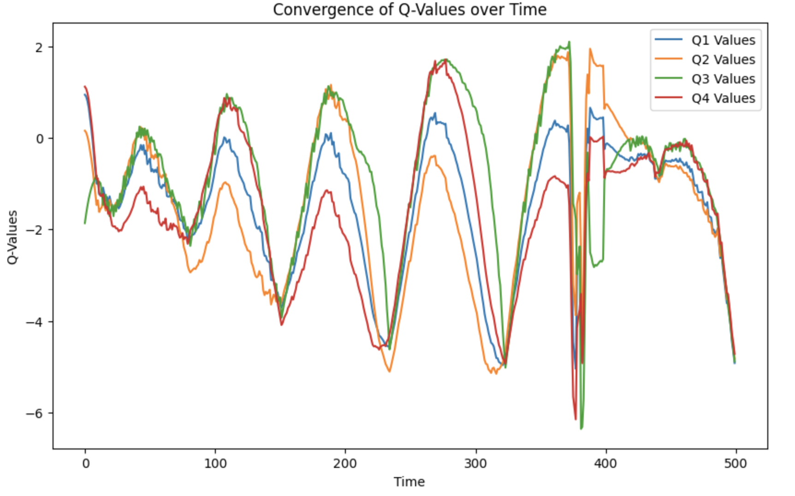
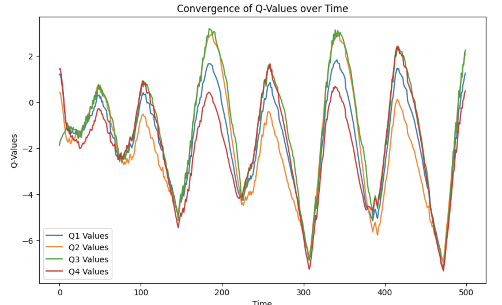
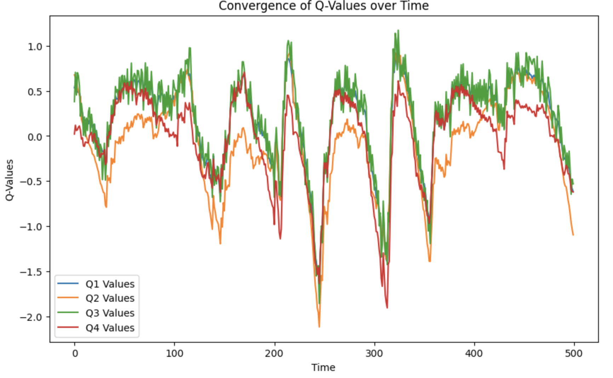
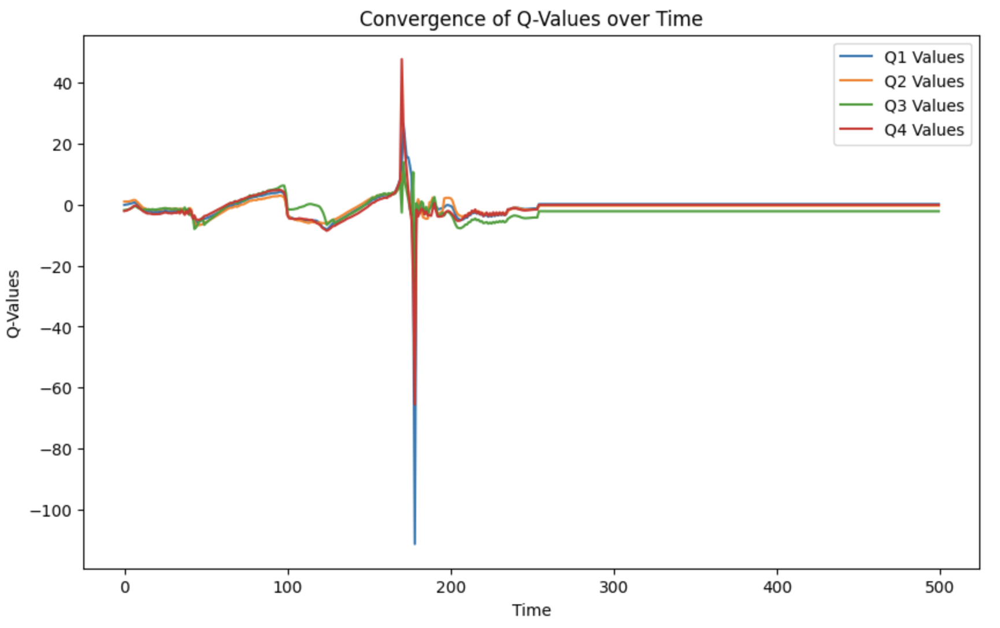
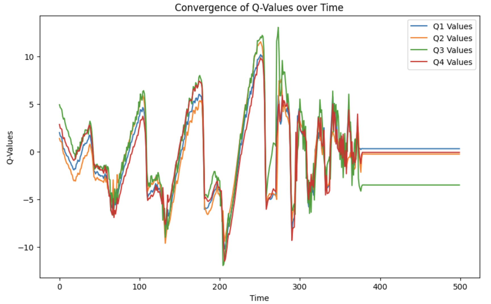
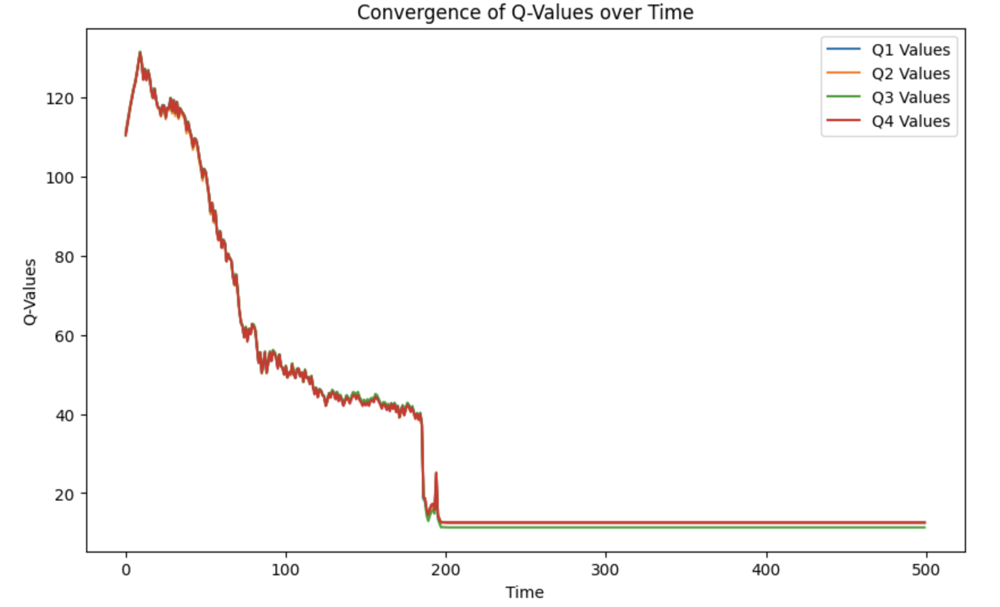

# Лабораторная работа 3

Выполнил Шерман Марк, гр. P4240

## Задание
1. Изучите ноутбук для данной работы
2. Провести эксперименты, подбирая наиболее оптимальный параметр для рассмотренной задачи, настраивая дисконтный фактор и анализируя изученные метрики.
3. Опишите выводы в readme и загрузите свои файлы на github.

## Выполнение

В качестве среды для обучения модели была выбрана [LunarLander-v2](https://gymnasium.farama.org/environments/box2d/lunar_lander/).

В ней возможно совершать 4 действия:

1) бездействие
2) активация левого двигателя
3) активация основного двигателя
4) активация правого двигателя

[Код решения](Lab3.ipynb)

## Вывод

В данной работе мы рассмотрели влияние параметра discount_factor на способность модели обучаться взаимодействовать со средой. Для этого мы провели два набора экспериментов.
Сначала мы обучили модель со стандартными параметрами, выбирая discount_factor из набора [0.01, 0.5, 0.99]. Чем больше значение данного параметра, тем модель более ориентирована на долгосрочные стратегии решения.
Для обучения выделили 100_000 шагов для каждого discount_factor.

discount_factor = 0.01. Ожидалось, что агент выучится как можно быстрее выполнять поставленную задачу, к сожалению стандртная модель не смогла справиться с задачей. Средняя награда -450.95 +/- 220.04

discount_factor = 0.5. Средняя награда -86.57 +/- 172.96

discount_factor = 0.99. Средняя награда -141.62 +/- 59.48

Во всех 3 случая модель так и не научилась выполнять задачу поставленную средой. Рассмотрим теперь модель с оптимальным набором параметров и будем изменять её discount_factor.

discount_factor = 0.01. Средняя награда -50.01 +/- 170.41. Достигнуть цели модель не успевает и выравнивается, стараясь не потерять больше очков.

discount_factor = 0.5. Средняя награда -9.02 +/- 165.82. Модель также не успевает решить задачу

discount_factor = 0.99. Средняя награда 225.97 +/- 60.14. Модель успешно выполняет задачу

В первых двух случаях вероятнее всего не хватило числа шагов, чтобы дообучить модель, из-за чего резкое снижение оценки заставляло их в конце концов сосредоточиться на уравновешивании своего состояния.
