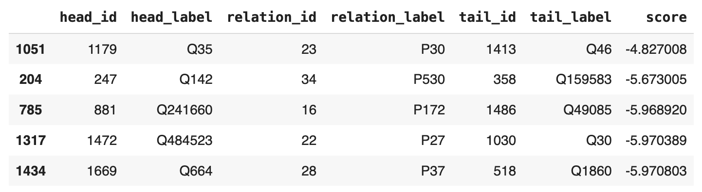

# Лабораторная работа 4

Выполнил Шерман Марк, гр. P4240

## Датасет

Был выбран датасет [CoDExSmall](https://pykeen.readthedocs.io/en/stable/api/pykeen.datasets.CoDExSmall.html#pykeen.datasets.CoDExSmall) - урезанная версия датасета 
[CoDEx](https://github.com/tsafavi/codex), содержащего граф знаний, собдранный из Wikipedia и Wikidata.

## Выполнение

[Код решения](Lab4.ipynb)

## Вывод
С использованием графовых нейронных сетей удалось успешно решить задачу предсказания отношений в датасете CoDExSmall. 
Использование библиотеки Pykeen упростило взаимодействие с графовыми данными.

Пять триплетов с наибольшим скором:

