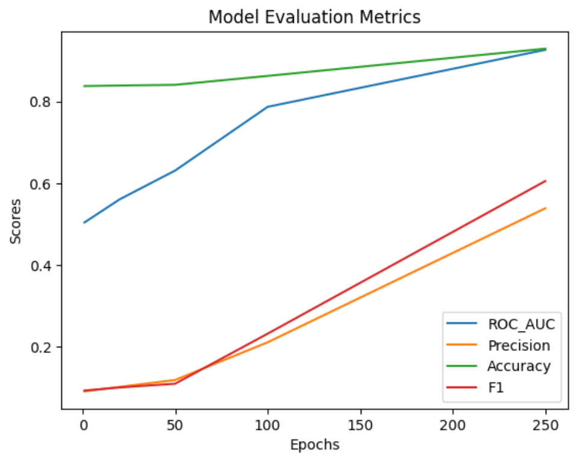
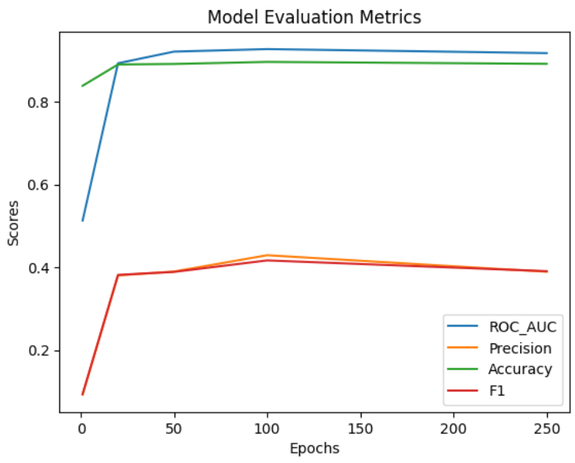

# Лабораторная работа 6

Выполнили:
* Полежаева Евгения (P4240)
* Солодкая Мария (P4240)

## Link Prediction
**Link Prediction** (предсказание связей) - это задача в области графовых знаний, направленная на предсказание отношений (рёбер) между сущностями в графовой структуре. В контексте баз данных знаний, где информация представлена в виде графа, задача link prediction становится важным инструментом для дополнения или обновления существующей сети отношений.

Задача link prediction заключается в предсказании отсутствующих рёбер между сущностями, основываясь на известных связях в графе.

Применения link prediction включают:

* Предсказание новых связей между пользователями или группами.
* Предсказание взаимодействий между белками в биологических сетях.
* Предсказание связей между пользователями и товарами.
* Пополнение базы знаний новыми фактами.

В контексте машинного обучения и графовых моделей, задача link prediction решается с использованием методов, таких как графовые эмбеддинги, глубокие нейронные сети, и другие алгоритмы, специфичные для графовых данных.

## Метрики для оценки работы модели

В рамках этой работы мы рассмотрим несколько classification метрик.

#### **ROC-AUC Score (Receiver Operating Characteristic - Площадь под кривой):**

* **ROC-AUC** - это метрика, используемая для оценки производительности бинарной классификационной модели.
* Измеряет площадь под кривой ROC, которая отображает соотношение верно положительных случаев к ложно положительным случаям при различных значениях порога.
* Более высокий показатель ROC-AUC указывает на лучшую дискриминацию между положительными и отрицательными случаями.

#### **Precision:**
* **Precision** - это метрика, оценивающая точность положительных предсказаний классификационной модели.
* Рассчитывается как отношение верно положительных предсказаний к общему числу положительных предсказаний (верно положительные + ложно положительные).
* Precision особенно важна, когда стоимость ложно положительных случаев высока.

#### **Accuracy:**
*  **Accuracy** - простая метрика, измеряющая общую правильность классификационной модели.
* Рассчитывается как отношение правильно предсказанных случаев (верно положительные + верно отрицательные) к общему числу случаев.
* В то время как Accuracy легко интерпретировать, она может быть несостоятельной для несбалансированных наборов данных, где один класс значительно превосходит другой.

#### **F1-мера (F1 Score):**
* **F1-мера** - это гармоническое среднее точности и полноты.
* Обеспечивает баланс между точностью и полнотой, что делает ее подходящей метрикой для несбалансированных наборов данных.

### Выводы

1. Использован датасет Kinships
2. Обучены две модели ComplEx и DistMult
3. Проведена оценка моделей

**Модель ComplEx**

**Модель DistMult**

4. С помощью метода predict_target() спрогнозированы связи в графе
5. Успешно решена задача предсказания отношений в графе
