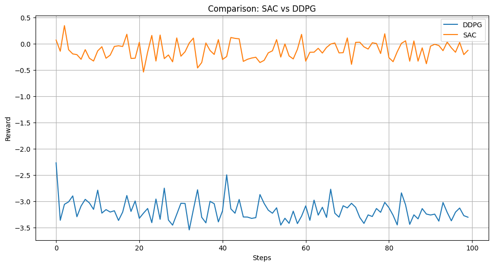
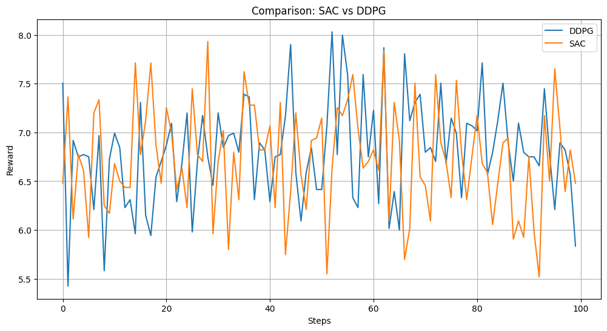
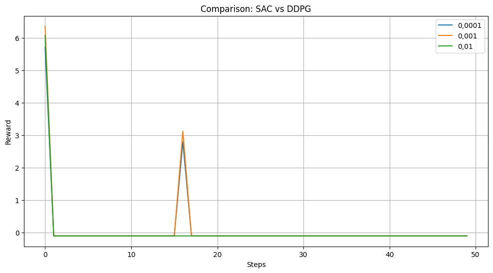

## Лабораторные работы по "Валидация и тестирование систем ИИ"
Выполнили:  
Расковалова Алена, P4241  
Строкова Анастасия, P4240

### Лабораторная работа 2
В рамках лабораторной работы были использованы различные стратегии и влияние learning_rate на процесс обучения агента на примере сред Ant и Car Racing.  
Выполнена следующая последовательность действий:
<li> Установка библиотек для работы над лабораторной работой (Gym, Stable-Baselines3, PyVirtualDisplay, Xvfb)
<li> Создание окружения (Ant и Car Racing)
<li> Исследование различных стратегий (Epsilon-Greedy, Softmax, Upper Confidence Bound)
<li> Тестирование различных моделей (DDPG, SAC)
<li> Построение графика, который отображает процесс обучения этих моделей
<li> Исследование влияния Learning Rate
 

**Часть 1. Среда Ant**  
[Код Ant](LR2_Ant.py)  
  
  
  

 

**Часть 2. Среда CarRacing**  
[Код CarRacing](LR1_Car_Racing.py)  

 
P.S. Размер файла ipynb из Google Collab превышает допустимый размер загружаемого файла на GitHub, поэтому выгрузка прилагается в формате py.
