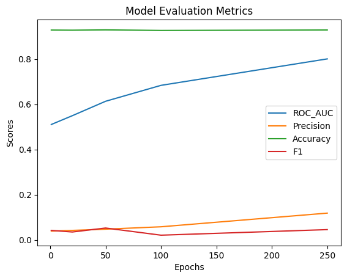

## Лабораторные работы по "Валидация и тестирование систем ИИ"
Выполнили:  
Расковалова Алена, P4241  
Строкова Анастасия, P4240
 
### Лабораторная работа 6
В рамках лабораторной работы была изучена задача Link Prediction (предсказание связей), направленная на предсказание отношений (ребер) между сущностями в графовой структуре.  
Выполнена следующая последовательность действий:
<li> Установка зависимостей и импорт необходимых пакетов (pykeen)
<li> Импорт выбранного датасета
<li> Рассмотрение метрик для оценки работы модели (ROC-AUC, Precision, Accuracy, F1-мера)
<li> Обучение модели ComplEx
<li> Визуализация полученных метрик после обучения модели и расчета
<li> Рассмотрение метода predict_target
<li> Повторение вышеописанных шагов с другой моделью
 

**Часть 1. Датасет Countries**  
[Код Countries](LR6_Countries.ipynbb)  

|ComplEs|TransE|
|---|---|
|  |  |

 

