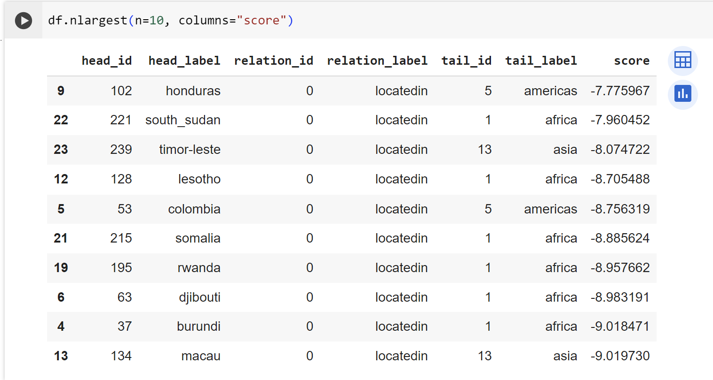

# Лабораторная работа 4

Выполнили:  
Веснин Дмитрий  
Евгений Федотовских  

### Описание проделанной работы
В рамках лабораторной работы была проведена работа по обучению графовой нейронной сети с использованием датасета "countries" из библиотеки Pykeen. Целью работы ставилось определение зависимостей и выявление отношений между различными странами.

Для реализации поставленной задачи была выбрана модель графовой нейронной сети (GNN), как один из актуальных и эффективных подходов эмбеддинга сущностей.

На вход сети поступали данные датасета, состоящего из многочисленных троек в формате: (сущность, отношение, сущность). Примером такого может быть тройка: (Страна1, граничит с, Страна2). Информация о географическом расположении, размере, численности населения и других факторов была кодирована в этих тройках.

В процессе обучения нейронной сети были получены представления (эмбеддинги) для каждой из сущностей. Эмбеддинги позволили обнаружить скрытые взаимосвязи между странами, которые не были явно указаны в исходных данных.

По окончании обучения сети, были выведены тройки, получившие наивысший score, который оценивает вероятность верности тройки.

Высокий скор указывает на высокую вероятность верности предположения, выраженного в тройке. Например, если тройка "south_sudan - является частью - africa" получила высокий скор, мы можем предположить, что наша модель правильно обучилась и может корректно оценивать отношения между странами.

### Заключение
В результате проведенного обучения модель демонстрирует хорошие результаты и может быть использована для дальнейших исследований и прогнозов.