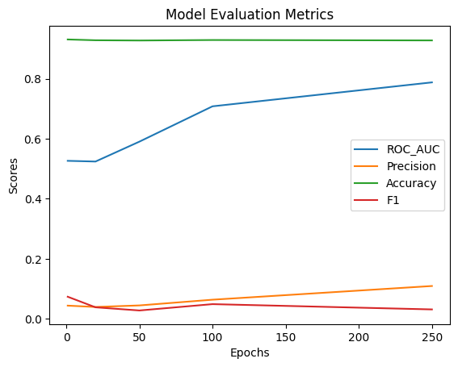

### Отчет по лабораторной работе 6
Выполнили:  
Веснин Дмитрий  
Евгений Федотовских  

В процессе работы было проведено обучение графовой нейронной сети на датасете 'countries' с использованием библиотеки PyKEEN. Модель ComplEx была обучена в течение разного количества эпох - от 1 до 250, что позволило взглянуть на динамику обучения модели.

Было замечено, что с каждой новой эпохой f1-метрика имеет тенденцию к увеличению, что говорит о повышении качества работы модели с увеличением количества эпох обучения.

В ходе работы также был изучен метод predict_target() из PyKEEN, который позволяет прогнозировать связи в графе. С его помощью были сделаны прогнозы относительно связи "americas - locatedin". Было обнаружено, что при малом количестве эпох обучения модели часто возникают ошибки в предсказаниях, но при увеличении количества эпох их количество уменьшается.

### Результаты предсказания ссылок

Результат при вычислении 1 эпох

         tail_label      score
      252  united_kingdom  73.286354

      199     saint_lucia  70.047195

      37          burundi  68.171555

      226       sri_lanka  63.734009

      200    saint_martin  60.089996

__________________________
Результат при вычислении 20 эпох

      tail_label      score
    
      191        qatar  84.762527

      31        brazil  76.028564

      114  ivory_coast  74.957169

      208   seychelles  68.807259

      27        bhutan  68.254761

__________________________
Результат при вычислении 50 эпох

         tail_label      score

      4    american_samoa  55.961647

      160           nauru  51.976105

      3           algeria  49.333885

      20       bangladesh  49.250443

      61          czechia  47.438843

__________________________
Результат при вычислении 100 эпох

                 tail_label      score

      169          norfolk_island  90.437836

      262       wallis_and_futuna  87.725464

      129                 liberia  70.532494

      125                    laos  69.040894

      266          western_sahara  67.972290

__________________________
Результат при вычислении 250 эпох

            tail_label      score

      49               chile  91.547623

      270      Åland_islands  58.968224

      99       guinea-bissau  58.305710

      193            romania  57.764679

      56          costa_rica  54.539776

__________________________