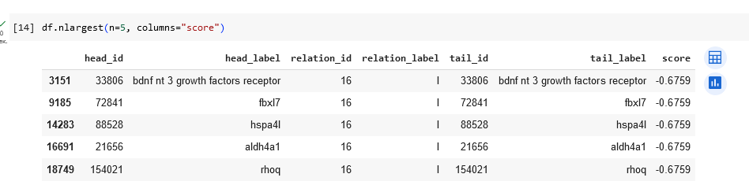

### Графовые нейронные сети ###

## Выполнение ##

В рамках данной работы необходимо было выбрать датасет для модели, был выбран - PharmKG

## Вывод ##

В ходе выполнения данной лабораторной работы было совершено знакомство с графовыми нейронными сетями. Была обучена модель для
анализа зависимостей в графовых структурах данных.

