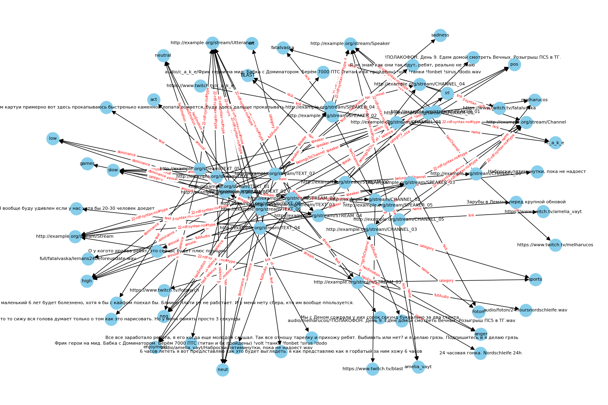

# Рекомендательная система видеохостинга с распознаванием эмоций

Данный репозиторий содержит датасет и RDF-граф, разработанные в рамках учебного проекта по созданию рекомендательной системы для видеохостинга, которая учитывает эмоции участников видеоконтента. Цель проекта — улучшить персонализацию рекомендаций, анализируя не только традиционные метрики, но и эмоциональную составляющую контента.

## Структура репозитория
1. Директория STRUCT: Содержит TSV-файлы с разметкой данных:
  - FEATURES.tsv — эмоциональные характеристики аудиофрагментов (текст, эмоция, валентность, активность, доминантность).
  - SPEAKER.tsv — данные о спикерах (никнейм, привязка к каналу).
  - CHANNEL.tsv — информация о каналах (название, ссылка).
  - STREAM.tsv — метаданные стримов (название, путь к аудио, категория, канал).

2. Директория audio:
Хранит аудиофайлы в формате .wav (полные записи стримов или фрагменты), например:
  - text
  - stream_1.wav

## Описание данных
Аудио-эмоциональный анализ

1. FEATURES.tsv:
text — транскрипция речи.
emotion — метка эмоции (радость, гнев и т.д.).

valence, arousal, dominance — числовые оценки эмоционального состояния.

Инструменты:

OpenSmile для извлечения аудио-признаков.

Ручная разметка эмоций или использование датасетов (CREMA-D).

Метаданные контента

2. SPEAKER.tsv: Привязка спикеров к каналам.

3. CHANNEL.tsv: Название и ссылка на канал.

4. STREAM.tsv:

category — тематика стрима (игры, музыка и т.д.).

full_audio_path — путь к аудиофайлу в директории audio.

Интеграция в RDF-граф
Граф объединяет данные через связи:

Спикер → Канал → Стрим.

Аудиофрагмент (Utterance) → Эмоция → Стрим.
Пример запроса для рекомендаций:
```python
import pandas as pd
from rdflib import Graph, Namespace, RDF, Literal, XSD, FOAF

# Загрузка TSV-файлов
features_df = pd.read_csv("/STRUCT/FEATURES.tsv", sep="\t")
speaker_df = pd.read_csv("/STRUCT/SPEAKER.tsv", sep="\t")
channel_df = pd.read_csv("/STRUCT/CHANNEL.tsv", sep="\t")
stream_df = pd.read_csv("/STRUCT/STREAM.tsv", sep="\t")

# Создание RDF-графа
g = Graph()
EX = Namespace("http://example.org/stream/")
g.bind("ex", EX)
g.bind("foaf", FOAF)

# ... (логика добавления триплетов из примера выше)
print(f"Количество триплетов в графе: {len(g)}")
```

## Граф знаний



## Пример запросов

В данном разделе представлены примеры запросов к RDF-графу, демонстрирующие различные способы извлечения информации из структурированных данных. Запросы позволяют анализировать связи между сущностями, фильтровать данные по определенным критериям и получать агрегированные результаты.

1. Получение всех текстовых фрагментов с эмоцией "anger"
```python
anger_utterances = []
for s, _, o in g.triples((None, EX.hasEmotion, None)):
    if str(o).lower() == "anger":
        text_literal = g.value(s, EX.text)
        anger_utterances.append((str(s).split("/")[-1], str(text_literal)))

print("------------------------")
print("Эмоция 'anger':")
print(anger_utterances)
print("------------------------")
```
2. Поиск всех стримов в категории "sports"
```python
sports_streams = []
for s, _, o in g.triples((None, EX.category, None)):
    if str(o).lower() == "sports":
        name = g.value(s, FOAF.name)
        sports_streams.append((str(s).split("/")[-1], str(name)))

print("------------------------")
print("Категория 'sports':")
print(sports_streams)
```
3. Определение канала для конкретного текстового фрагмента
```python
text_uri = EX["TEXT_04"]
speaker = g.value(text_uri, EX.speaker)
channel = g.value(speaker, EX.hasChannel)
text_id = str(text_uri).split("/")[-1]
channel_id = str(channel).split("/")[-1] if channel else "Нет канала"

print("------------------------")
print("TEXT_04 связан с каналом:")
print(channel_id)
print("------------------------")
```
4. Дополнительные примеры запросов
```python
emotion_counts = Counter()
for _, _, emotion in g.triples((None, EX.hasEmotion, None)):
    emotion_counts[str(emotion).lower()] += 1

print("------------------------")
print("Распределение эмоций:")
print(dict(emotion_counts))
print("------------------------")
```
